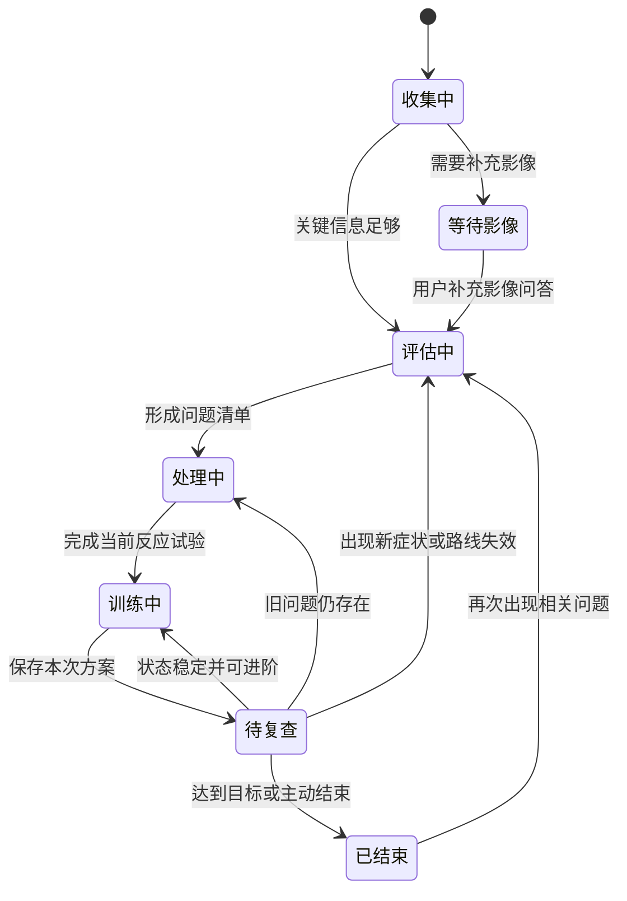
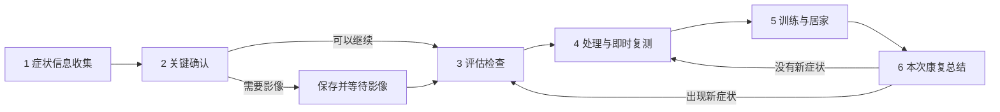
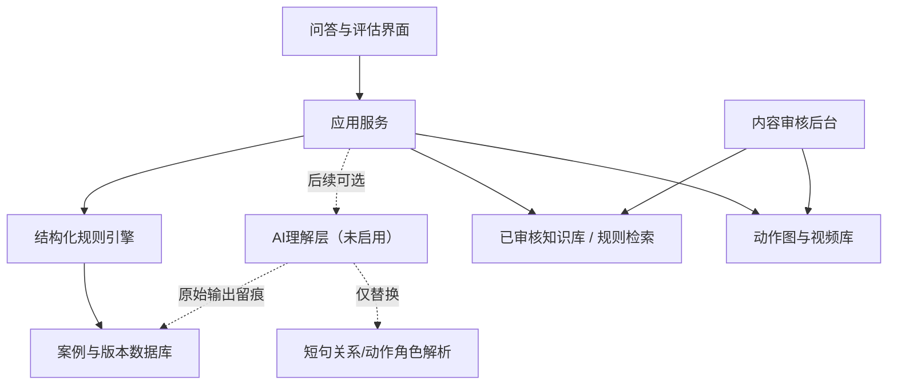

# RehabMind 运动康复思路助手：完整产品设计方案

> 版本：1.4（第一版采用本地解析，预留 AI 可插拔接口）  
> 产品定位：面向正在学习运动康复、或希望拓展康复业务的健身、普拉提、瑜伽等教练，提供以主诉为中心、以评估结果为依据、以处理后反应为验证的专业决策辅助。  
> 本方案用于统一产品、交互、临床规则、内容、AI、数据和研发实施，不替代产品上线前的临床、隐私与法律审核。

### 本轮确认的产品规则

以下规则来自近期连续评审，覆盖并替代本文中与其冲突的旧描述：

1. 自由描述中没有出现的信息保持为空，并明确提示补充；不得默认身体区域、侧别、位置、时间、机制、症状、目标、问题动作或评分。
2. 0～10 分使用用户能理解的行为描述；首次收集不展示复测条件，速度、幅度、负重和扶持等条件只在真正复测时提示。
3. 检查项目由主诉、部位、机制、时间、当前刺激程度和恢复目标动态生成。普通崴脚不自动加入足趾、足底、跳跃等全部踝足项目。
4. 急性崴脚的骨性问题不作为一个含糊的“骨性风险组合”测试，而是在关键确认中解释目的后，询问特定骨性位置压痛、受伤当时和现在的承重能力及影像情况。结果用于决定影像优先级，不等于骨折诊断，也不因单独骨点压痛永久锁死流程。
5. 检查发现持续进入右侧“已收集信息”，用“某方向活动受限”“某肌肉力量偏弱”“某动作会引起症状”等行动语言显示；主工作区不重复展开完整问题清单。
6. 第四步页面主标题始终为“针对性处理”。处理卡只显示要改善的问题、处理部位、现在做什么和怎么做；权限、原因、候选序号、停止条件和复测规则不放进处理卡，完成处理后再单独显示复测。
7. 肿胀、压痛和力量不做每项处理后的即时反复复测。肿胀每次康复只登记一次，重点执行允许范围活动、垫高、负荷调整以及权限允许的回流、理疗或遵医嘱外用药，下一次康复再比较趋势。
8. 疼痛动作处理后使用同一条 0～10 分滑条，系统根据分数下降、不变或升高自动生成“保留、换下一项、停止”状态，不再追加一组意义重复的“有没有改善”按钮。
9. 单次居家方案不能因阶段筛选只剩一个动作。急性反应或基础症状目标至少覆盖 2 个动作；恢复正常生活及以上至少覆盖活动、基础力量/控制、生活功能 3 个维度，当前阶段不能完成时给基础版。
10. 第六步统一为“本次康复总结”，固定显示本次排查问题、做过的处理及有效性、居家训练和下次重点关注事项。
11. 所有前台问题和操作说明使用普通用户能听懂的问句和动作词。专业解剖名词可以保留，但“固定复测条件”“骨性风险组合”等系统术语不得直接成为卡片标题；像“走路时脚跟到脚尖的过渡”这类不能明显改变本次路线的问题不单独追问。
12. “现在复测”只保留一个主指令：回到原来的疼痛或受限动作并重新评分或比较范围。相同速度、幅度、负重和扶持等条件放进次级提示，不能与主操作同级抢占注意力。
13. 评估页只显示检查方法、可选结果和完成进度，不在每项检查后展示“当前结果”或向用户解释系统将进入哪条处理路径。路线判断留在后台规则中。
14. 肿胀与按压痛必须分别记录具体位置；用户没有描述时显示“待确认”，不能直接拿主诉位置代替。后续复查必须回到同一位置比较。
15. 处理名称必须写成已经实际完成的动作，例如“腓骨肌与小腿前外侧轻柔松解”“距骨背屈方向关节松动”“肿胀管理”，不能继续沿用“检查某肌肉”“检查某关节”等候选来源名称。
16. 前台不使用含义不清的“如具备相应资质”。系统直接说明操作角色和能力边界：本人可做、教练辅助、或仅由掌握该手法的治疗师操作；外用药按说明书或医嘱使用。
17. 主诉处理后，评估发现的活动度问题仍需进入处理与复测，但处理单位应是“最直接的一组肌肉或关节手法”，不是把每个受限方向各复制一套流程。系统根据拮抗肌紧张、同功能肌疼痛/紧张、力量和原动作反应，只选择一组最直接的肌肉处理，并一次性复测它关联的全部未解决方向；主动、被动都接近健侧的方向退出，被动接近但主动不足的方向转主动控制，只要被动仍不足——无论有一点改善还是完全无效——都直接转对应关节松动，不再继续轮换其他肌肉。疼痛动作仍使用0～10分。
18. 第二次、第三次及以后康复先追加复查，再决定处理。上一节明确有效的方向可以保留；上一节无效或加重的同一肌肉区域不自动重复，除非出现新的症状或新的检查依据。每次训练结束都要再做一次整体主诉复测，并把“本次复查、训练前、训练后”分别保存，不能直接用处理后的分数结束本次记录。
19. 症状信息必须实际改变后续流程，不能只用于摘要展示：酸痛、牵扯或紧绷优先活动度、肌肉状态和力量检查；刺痛或胀痛优先活动度、局部刺激和高相关专项检查；麻或电感优先感觉分布、肌力趋势和神经相关检查；无力或不稳优先力量与控制检查；“发力会不适”优先对应力量检查，并记录该发力动作的0～10分。评估标签继续参与肌肉处理、控制训练和居家训练排序，但这些表现只改变检查重点，不直接诊断病因。
20. 处理步骤始终提供“返回评估检查”。前台统一使用用户动作语言：“与健侧比较”“根据受限方向做关节松动”“轻柔检查”，不显示“相关方向”“剩余方向”“低刺激变量”“当前路线”等系统表达。
21. 症状收集采用“自由描述 → 确认识别结果 → 按需补充”的渐进方式。所有人只回答部位、时间、感觉、诱发方式、主诉动作、评分和恢复目标；发力方向、肿胀位置、按压痛位置及麻电范围只在对应情况出现后追问。
22. 主诉动作不能只保存或引用原句。系统需要把它整理为“动作名称、动作类别、负重状态、主要功能、活动或发力方向”五类信息，例如“下楼膝内侧刺痛”整理为“下楼梯 / 楼梯动作 / 负重 / 单腿承重与髋膝踝减速控制 / 屈髋屈膝与踝背屈”。结构化结果必须展示给用户确认，并实际参与功能检查、力量检查、处理候选、复测提示和训练排序。
23. 进入评估检查、处理复测、训练和康复总结前增加独立的阶段提醒页。提醒页只显示阶段编号、完成状态、下一步一句话和继续按钮，不重复医学解释、问题清单或系统判断。返回按钮回到刚完成的阶段，继续按钮才正式进入下一阶段。
24. 第一版先不接入 AI 接口，使用“输入提示 + 本地规则解析 + 证据校验 + 用户确认 + 定向追问”跑通完整流程。AI 只作为后续可插拔的语言理解层，不能替代安全规则、康复知识库和用户确认。
25. 后续 Demo 默认只实现和验收桌面端，不同步处理手机端布局、交互或适配。只有用户明确要求“同步手机端”或“增加手机适配”时，才把移动端纳入该轮工作；最终产品的移动端规划可以保留，但不能自动扩大每次 Demo 的开发范围。
26. 症状侧别、动作方向和比较对象必须分开保存。“右侧颈肩交界向左转头痛”中的症状侧别是右侧，动作方向是向左，不能互相覆盖。四肢活动优先与健侧比较；颈、胸椎和腰椎的左右旋转/侧屈与另一方向比较；正中屈伸与自己平时可用范围比较。脊柱力量检查记录完成质量、控制和耐力，不显示“患侧力量偏弱”。
27. 踝足目前已有方向化的肌肉、关节松动和主动控制路径，其他区域也必须达到同一内容标准：每个受限方向都要有高相关肌肉候选、关节处理方向、主动控制训练和明确复测项目；同一处理关联多个方向时合并处理、一次复测，不能让上肢和脊柱继续长期沿用通用候选模板。
28. 肌肉松解之后在同一处理轮内加入8～10次轻量主动活动，用于把刚获得的活动范围交还给主动控制；它不是单独训练卡，也不增加一次复测，完成整轮后统一复测原问题。
29. 急性踝扭伤不把冰敷写成必做或推荐动作。若用户说自己已经冰敷，只记录既往处理，并使用“目前证据不能确认它能改善肿胀、活动度或恢复”的中性说明。
30. 自由描述没有识别出部位时，必须明确提示“没识别出部位，请点选膝关节或踝关节”；同时提到左、右两侧时不得擅自选边，必须让用户确认主要侧或双侧。
31. 描述中提到“拍过片没骨折、医生允许康复、医生有限制”等信息时，自动带入关键确认，但仍允许用户修改；既往处理和影像结论必须改变安全提示或后续路线，不能只出现在摘要里。
32. 单侧评估统一使用“与健侧比较、哪边更容易掉力、发力时有没有不适”等普通表达；专业肌肉名可以保留，操作提示不使用“健侧肌力、代偿模式”等没有解释的术语。双侧问题不使用健侧，改为记录更差侧。
33. 恢复目标只代表最终要到达的层级，不等于第一次康复可以直接进入该层。急性期、当前评分较高、活动明显受限或所有试处理均无即时变化时，当前训练自动降到低刺激基础活动，首轮只保留1～2组、每组5～8个或短距离练习。
34. 肌肉去重按实际区域单元而不是候选标题或ID。组合区域需要拆成前侧、外侧、后侧等单元；例如已经处理“小腿前外侧”，后续不能换名再次显示“小腿外侧”，但尚未处理的小腿后侧仍可在有依据时进入。

## 0. 普通用户主线总则（2026-08 确认）

产品当前**主线是面向无专业背景的普通用户**，专业人士（教练/康复师）路径后续单独优化。因此：

1. **普通用户只提供"自己能完成"的内容**：动作测试、自我轻柔放松、训练。一切需要手法（关节松动、神经滑动、骶骨/大转子/第一肋处理）、被动检查、专业触诊的内容，对普通用户**不出现**。
2. **神经信号 → 直接转介**：普通用户描述麻、电、放射、针刺等神经信号时，不提供任何自我处理选项，直接提示"建议线下专业评估"，保存记录后结束自助流程。神经问题需专业判断，自我处理有加重风险。
3. **评估可做弯腰，训练绝不安排弯腰**：评估阶段弯腰/后仰/侧屈等方向可以检查（只做一次，诊断性）；训练阶段任何动作不得包含弯腰成分（弯腰反复做对椎间盘/肌肉/韧带有负担且练不到东西）。训练中的"屈髋"是髋关节活动，出现弯腰（腰椎屈曲代替髋屈曲）即动作错误，需纠正提示。
4. **无主诉动作时以评估发现为主**：主诉动作不完整/不清楚/无法当场复现时，不创建虚假动作复测；处理与训练都以评估检查出的问题（活动受限、力量不足、局部反应等）为对象，并在 UI 明确告知用户。
5. **题量控制**：普通用户全程作答目标 ≤15 次。功能检查采用"两级询问"——选"基本正常"不追问，选"动作异常/出现原症状"才追问阶段（起始/中途/末端/全过程/说不清），选阶段后可再追问位置与 0～10 分。复用条件追问机制，不预先展示完整问卷。

## 1. 方案依据与设计结论

本方案整合以下现有规范：

- [通用决策流程](./rehab-decision-framework.md)
- [线下康复记录经验地图](./clinical-record-joint-map.md)
- [全身关节统一总结](./remaining-joint-record-map.md)
- [动作演示系统方案](./motion-demo-system-plan.md)
- [全关节 Demo 测试用例](./full-joint-demo-test-cases.md)

最终产品不应是“输入症状后输出一套动作”，而应完成下面这件事：

```text
听懂用户的主诉
→ 补齐少量会改变路线的信息
→ 选择高相关检查
→ 找出当前需要处理或跟踪的问题
→ 一次尝试一个处理方向
→ 用相同动作和评分验证反应
→ 补齐活动、力量和动作模式
→ 按恢复目标生成分阶段训练
→ 下次从上次问题继续，而不是重新开始
```

### 1.1 产品必须坚持的十条原则

1. 主诉是本次最高优先级，查体发现用于帮助解决主诉。
2. 恢复目标决定评估和训练需要覆盖到什么范围。
3. 问题复现动作由系统或教练选择，不要求患者自己说出精确目标动作。
4. 单侧问题优先比较本人伤前和健侧，不盲目追求统一标准角度。
5. 主动受限、被动接近健侧，优先进入疼痛抑制、力量和动作控制路径。
6. 主动和被动都受限，肌肉与关节同时进入候选；先看肌肉反应，改善不足再考虑专业关节松动。
7. 一次只改变一个主要变量，随后立即复测相同动作。
8. 疼痛和可安全复现的不适可以即时量化；肿胀、压痛、力量和组织恢复按合适时间随访。
9. 训练不是“哪里弱练哪里”，而是恢复目标所需的活动、力量、稳定、力传导和动作模式。
10. 安全边界采用分层确认，不用大量“停止处理”文案削弱产品实用性。

## 2. 用户、场景与产品边界

### 2.1 核心用户

| 用户 | 能力特点 | 主要需求 | 产品支持方式 |
| --- | --- | --- | --- |
| **普通用户（无专业背景，本轮主线）** | 没有康复专业知识，说不出精确诱发动作，无法执行任何手法 | 解决自身损伤疼痛问题，获得"现在能做什么/该不该去线下"的明确指引 | 自由描述→自动解析→一键确认；只提供动作测试、自我放松和训练；神经信号或手法需求→直接转介线下 |
| 学习型教练 | 知道基础解剖和训练，但评估思路不完整 | 学会从主诉到检查、处理和训练 | 逐项引导、健侧比较、只显示当前任务 |
| 业务拓展型教练 | 有带课经验，康复经验较少 | 为常见运动和日常功能问题建立处理路线 | 高相关问题筛选、动作演示、候选反应试验 |
| 有基础的运动康复从业者 | 会部分触诊和手法 | 提升记录、复测和后续训练的系统性 | 受训者内容、关节松动、完整随访 |
| 内容审核者 | 有临床或康复经验 | 审核规则、动作、手法和训练进阶 | 内容后台、版本、来源和审核状态 |

### 2.2 典型使用场景

- 急性崴脚、拉伤、碰撞后，不确定是否可以开始低风险康复。
- 下楼、下蹲、走路、抬手、推拉等动作出现疼痛或不适。
- 没有明显疼痛，但存在卡、挤、扯、紧、无力、不稳或发力不顺。
- 影像报告已经给出骨折、韧带、肌腱、积液或骨髓水肿等结论，需要结合功能重新评估。
- 第一次康复后进入第二次、第三次复查，决定继续处理、保持训练、退阶或进阶。

### 2.3 产品不承担的工作

- 不根据一段文字直接给出结构诊断。
- 不用单个特殊测试或一次手法反应确定病名。
- 不覆盖医生已经给出的固定、负重、活动范围和术后限制。
- 不向未经训练者开放高风险诱发测试或具体关节松动手法。
- 不用固定病名套餐替代个人评估。

## 3. 产品信息架构

### 3.1 一级导航

桌面端建议设置四个一级入口，手机端底部最多显示三个高频入口，其余放入“我的”：

1. **开始评估**：新建第一次康复记录。
2. **康复记录**：查看等待影像、康复中、待复查和已结束案例。
3. **动作库**：评估、处理和训练演示；按照权限展示。
4. **内容管理**：仅审核者和管理员可见。

手机端底部导航：

```text
[开始评估]   [康复记录]   [我的]
```

动作库从评估、处理或训练页面按上下文进入，不在手机底部抢占主要位置。

### 3.2 案例状态



## 4. 完整业务流程

产品主流程固定为六步，但评估题目和处理内容动态生成：



### 4.1 步骤锁定规则

- 后一步在前一步未完成时不可点击。
- 已完成步骤可以返回修改；修改会使受影响的后续结果失效并提示重新确认。
- 返回上一步时保存当前输入，不清空记录。
- 等待影像不删除本次记录，案例状态改为“等待影像”。
- 步骤条只显示当前步骤、已完成步骤和下一步，不展示无法操作的复杂分支。

## 5. 第一步：症状信息收集

### 5.1 页面目标

用最少问题确定：当前主要问题、发生过程、恢复目标、第一批评估方向和必要安全背景。

### 5.2 首屏设计

首屏只有一个主要输入任务：

```text
哪里不舒服？发生了什么？

[ 例如：右膝下楼梯时内侧刺痛，两周前跑步后开始，平时走路还好…… ]

[继续]
```

输入框支持：

- 自由文字。
- 语音转文字，后续版本加入。
- “不知道怎么描述”入口，展开部位、感觉和场景三个简单选择。
- 用户未找到匹配选项时继续保留原话，不强制归入固定选项。

### 5.3 结构化提取

系统从原话中提取：

- 身体部位和侧别。
- 当前主要问题。
- 疼痛或不适的位置。
- 出现时间和持续时间。
- 急性事件或逐渐出现。
- 受伤机制或诱发场景。
- 症状性质：疼、酸、胀、刺、挤、扯、卡、麻、电、无力、不稳等。
- 动作和发生阶段。
- 变化趋势。
- 当前功能影响。
- 影像情况。
- 恢复目标。

提取后不进入长表单，而是显示“已收集到的信息”：

```text
主要问题    下楼梯时右膝内侧刺痛        [修改]
开始时间    约两周前                    [修改]
发生方式    跑步后逐渐出现              [修改]
恢复目标    正常生活并恢复跑步          [修改]
还需确认    2项关键信息
```

只有能够从原话中明确识别的字段才进入表格。未提到的字段显示“待确认”或留空，由后续问题补充；不能为了让表格完整而自动填入常见答案。用户切换身体区域时，也不能顺带默认第一个疼痛位置或第一个功能动作。

肿胀与按压痛使用独立位置字段。勾选了相应症状但没有具体位置时，必须补问“具体哪里肿胀或有淤青？”或“具体哪里按压会痛？”。两个字段分别保存，不能合并成模糊的“局部反应”，也不能默认继承主诉位置。

### 5.3.1 第一版本地解析方案

第一版不把文本中出现的所有动作都当作“主诉不适动作”。每个动作先判断它在句子中的作用，再决定是否进入后续复测。

#### 动作角色污染问题与修复

旧方案的问题是只找“动作词”，没有判断动作和症状之间的关系。这样会把受伤经过、阴性动作、症状出现时间和恢复目标误写成主诉动作，后续就会生成错误的动作检查、处理和复测。

第一版改为两层数据：

```text
动作候选：原文中出现的所有动作，先保存证据和角色
主诉动作：只有明确与当前症状相连、并经用户确认的动作
```

只有“主诉动作”才能进入处理前后复测。受伤经过只用于判断损伤场景，阴性动作用于排除不相关动作，症状时间用于判断急慢性，恢复目标只用于后期训练进阶。若没有明确主诉动作，`reproduction` 保持空值，流程改为活动度、力量、局部反应或安全复查，不创建虚假的动作复测。

前台确认区必须把“怎么受伤”和“现在什么情况下不舒服”分开显示。用户确认“暂时没有固定动作”也是有效结果，不能因为流程需要完整字段而强迫用户选择一个动作。

#### 解析字段

```ts
type IntakeFact = {
  value: string;
  evidence: string;
  confidence: "high" | "medium" | "low";
  source: "rule" | "user";
  status: "confirmed" | "needs-confirmation";
};

type ActionFact = IntakeFact & {
  role: "injury-event" | "provoking" | "negative" | "timing" | "goal" | "unknown";
};
```

问诊信息至少分开保存：

- 当前主要问题：现在什么地方有什么感觉或变化。
- 受伤经过：崴脚、跌倒、跑步拉伤等发生了什么。
- 诱发动作：现在做什么会引起或加重症状。
- 阴性动作：明确说做了但没有症状的动作，例如“走平路还好”。
- 症状时间：运动过程中、运动结束后、第二天或静止时出现。
- 恢复目标：想恢复走路、上下楼、跑步或对抗运动。

“诱发动作”允许为空，不能因为文本中出现了跑步、走路或下楼，就直接写入主诉动作。

#### 本地解析步骤

```text
原始描述
→ 按标点和时间词拆成短句
→ 提取部位、侧别、感觉、时间和动作词
→ 根据关系词判断动作角色
→ 保存原文证据和置信度
→ 检查否定、时间和前后矛盾
→ 让用户确认或补充
```

关系词和动作角色的基本规则：

| 表达 | 识别结果 |
|---|---|
| “跑步时把脚崴了” | 受伤经过，不是当前诱发动作 |
| “跑步时膝盖疼” | 当前诱发动作：跑步 |
| “跑步后开始疼” | 症状出现时间，不直接认定跑步过程中会疼 |
| “走平路还好” | 阴性动作：走平路 |
| “想恢复跑步” | 恢复目标，不是当前疼痛动作 |
| “下楼时膝内侧刺痛” | 当前诱发动作：下楼 |
| “现在外踝肿，静止也胀” | 当前问题和静息症状，诱发动作可以为空 |

#### 置信度与矛盾处理

- 高置信度：句子明确把动作和当前症状连接起来，直接作为候选并展示给用户确认。
- 中置信度：可能是诱发动作，也可能是发生经过或症状时间，显示“需要确认”。
- 低置信度：只保留原文，不填入诱发动作。
- 出现“还好、不痛、没事、不会”等否定词时，动作不得进入诱发动作字段。
- 同一动作同时被识别为“会痛”和“不会痛”时，保留两条证据并追问，不自动覆盖。
- 只有“跑步后疼”而没有明确当前动作时，不能生成固定复测动作。

#### 用户确认界面

解析后只展示四组信息：

```text
怎么出现的：跑步时崴了右脚
现在主要问题：外踝肿胀
什么情况下会加重：还没有确定
恢复目标：恢复跑步
```

如果没有明确诱发动作，显示：

```text
会引起或加重不适的动作：待确认
```

随后只追问一个问题：

> 目前哪种情况最容易让这里不舒服？

选项为活动到某个角度、用力或对抗阻力、走路站立或负重、按压、静止或夜间、说不清。用户可以选择“暂时没有固定动作”，流程继续进入评估检查。

#### 本地规则的适用边界

本地规则适合处理明确的部位、侧别、时间、疼痛性质、常见动作和否定词。遇到隐含表达、多段经历、前后矛盾或无法判断动作角色时，第一版不猜测，转为用户确认或定向追问。

后续如果接入 AI，AI 只替换“短句关系和动作角色理解”这一层，输入输出字段、证据校验、用户确认和规则引擎保持不变。

### 5.4 动态追问

- 描述完整：通常补问 2～4 项。
- 慢性或逐渐出现：通常总共确认 4～6 项。
- 急性损伤：通常总共确认 5～8 项。
- 每题提供“不确定”“说不清”“暂时没注意”。
- 已从自由输入中明确的信息不重复提问。
- 活动度、力量、触诊和特殊测试不放在问诊阶段。

追问优先级：

```text
会改变安全路线
> 会改变第一批检查
> 会改变恢复目标阶段
> 只用于解释但不影响当前行动
```

最后一类问题不在主流程追问。

### 5.5 疼痛/不适评分

前台名称统一为“疼痛/不适评分（0～10）”。0～10 数字滑条属于 NRS 风格；产品不需要向普通用户解释量表术语。

```text
现在的疼痛或不适有多重？

0  没有疼痛或不适  ━━━━━━━●━━━  10  极重，无法继续当前动作
当前：6分

1～3 轻微，基本不影响动作
4～6 明显，会影响动作
7～9 很重，难以继续
```

三个辅助区间在视觉上分别对齐滑条前段、中段和末段，仅帮助用户选分，不作为诊断或统一严重度分级。

记录规则：

- 每个分数绑定具体感觉和具体情境。
- 优先记录当前主要问题在问题复现动作中的分数。
- 无法安全复现时，记录静息或最近一次出现时的分数，并标注情境。
- 不把不同动作、不同感觉或不同时间条件的分数直接相减。
- 评分低不覆盖明显错位、循环、感觉或进行性无力等信号。
- 首次评分页不展示“相同速度、相同负重、相同扶持”等复测要求；这些条件在处理后复测和后续康复复查时出现。

### 5.6 恢复目标

用户不需要给出精确动作，选择大致目标即可：

1. 急性反应减轻：希望不再明显肿胀或静息难受。
2. 基础症状改善：疼痛或异常感觉明显减轻。
3. 正常日常生活：走路、上下楼、穿衣、拿取等基本任务。
4. 恢复一般运动：力量训练、跑步、瑜伽、普拉提或球类练习。
5. 恢复高强度与对抗：高速、疲劳、变向、碰撞或专项表现。

高等级目标自动包含前面的所有阶段，不能跳过基础功能。

### 5.7 结束条件

满足以下条件后停止追问：

- 当前主要问题已明确。
- 发生时间和过程已明确。
- 已完成必要安全背景收集。
- 当前功能影响已明确。
- 恢复目标层级已明确。
- 可以选择第一批评估项目。

## 6. 第二步：关键确认

### 6.1 页面目标

只确认会改变“现在能否继续评估、是否需要先补充影像、检查允许做到什么程度”的信息。

### 6.2 默认只显示四类问题

1. 是否存在明显错位、异常轮廓或开放伤口。肿胀和淤青不等于明显错位。
2. 远端肢体是否持续明显苍白、灰暗、发凉、感觉下降或麻木加重。局部受伤淤青单独记录。
3. 是否出现进行性无力，或腰背问题伴大小便、会阴感觉异常。
4. 是否发热并伴局部红、热、肿快速恶化。

急性损伤根据前面机制追加：

- 是否完全不能承重或使用。
- 是否存在集中骨点压痛。
- 是否已经影像检查。
- 是否有医生给出的活动或负重限制。

这些信息采用组合判断，不能因为“骨点压痛”一个选项就永久阻断处理和训练。

急性崴脚的追加卡片标题使用用户能理解的问句：**“急性崴脚后，要不要优先拍片确认骨头？”** 卡片先说明“这组问题只判断拍片优先级，不是让你自己判断有没有骨折”，再依次询问：

1. 最明显压痛是否集中在脚踝两侧突出的骨头、足外侧骨头突起或足弓内侧骨头突起；普通软组织压痛、肿胀和淤青不算。
2. 刚受伤后当时能否自己连续走四步；允许跛行，不要求现在重现。
3. 现在能否在安全扶持下连续走四步；不能通过硬走来证明安全。
4. 是否已有影像或医生给出的负重、活动范围限制。

出现一个线索时提高警惕但不自动诊断；线索组合、明显错位或其他安全信号才提高影像与医学确认优先级。没有明显错位等危险信号时，可保存记录并继续低刺激检查，暂不安排跳跃、强压和高刺激关节手法。

### 6.3 影像问答

第一版不解析不同医院的报告原文，采用结构化问答：

- 没有做影像。
- 未见骨折。
- 有骨折或骨裂异常。
- 韧带损伤或撕裂。
- 肌腱损伤或撕裂。
- 骨挫伤或骨髓水肿。
- 积液或软组织肿胀。
- 医生已允许按建议康复。
- 医生给出了固定、负重或活动限制。
- 不确定报告写的是什么。

如果需要先拍片：

```text
保存本次记录
→ 状态改为“等待影像”
→ 用户拍片后进入原案例
→ 回答影像结构化问题
→ 结合当前症状和功能重新评估
```

### 6.4 三层结果

| 结果 | 界面表达 | 后续动作 |
| --- | --- | --- |
| 及时医学处理 | “当前先完成针对性医学处理” | 保存信息，不展示诱发检查或手法 |
| 补充影像/专业检查 | “建议先把这项情况确认清楚” | 保存案例，允许查看等待期间的低风险记录或医生允许内容 |
| 可以继续康复评估 | “可以进入本次功能检查” | 生成动态检查队列 |

## 7. 第三步：动态评估检查

### 7.1 评估队列生成原则

评估不是完整体检清单，由两条线共同生成：

- 主诉线：筛出当前疼痛、不适和局部高相关问题。
- 目标线：从恢复目标反推需要具备的活动、力量、稳定、耐力和动作模式。

检查顺序：

```text
局部观察与触诊
→ 关节各方向主动活动
→ 受限方向的被动活动
→ 相关肌肉力量
→ 高相关特殊测试
→ 问题复现动作
→ 达到恢复目标需要的功能检查
```

急性肿胀明显时先降低检查强度，不强测末端范围。

“检查关节各方向”不等于“把整个区域所有测试都做一遍”。核心关节方向可以逐项比较，但附属部位、专项功能和特殊测试必须由主诉触发。例如普通外踝崴伤先看踝背屈、跖屈、内翻、外翻、相关力量、承重和步态；只有主诉涉及脚趾、前脚掌、足底、足弓或蹬地时才增加足趾检查，只有恢复阶段和功能允许时才加入提踵、单腿和跳跃。

### 7.2 每屏只做一个检查

检查页固定由四部分组成：

```text
检查名称
怎么做
观察什么
结果选择
```

不在同一屏解释解剖学原理、所有可能病名和后续完整方案。

用户选择结果后，页面只把该项目标记为“已记录”并进入下一项。不显示“当前结果”“主动控制路径”“肌肉＋关节路径”等后台解释；这些规则只负责生成后续候选。

结果按钮示例：

- 接近健侧。
- 患侧明显更少。
- 角度接近但会出现原症状。
- 不敢或不能完成。
- 暂不测试。

### 7.3 活动度规则

- 每个关节主要方向逐项比较，不使用“四方活动正常”这类合并描述。
- 无工具用户先做健侧，再在相同体位做患侧。
- 主动异常时才进入被动比较。
- 对侧有旧伤、双侧症状或整体体能下降时，结合伤前状态、任务要求和必要常模。
- 精确角度作为受训者增强项，不要求普通用户自行量角。

统一判断：

| 主动 | 被动 | 主要路径 |
| --- | --- | --- |
| 接近健侧 | 不需要追加 | 继续其他方向或功能检查 |
| 受限 | 接近健侧 | 疼痛抑制、力量和主动控制 |
| 受限 | 同样受限 | 肌肉＋关节共同处理 |
| 范围接近但疼 | 可正常或疼 | 疼痛动作排查，不标记为单纯活动受限 |
| 无法测试 | 未测试 | 保留未知，按安全条件决定替代检查 |

### 7.4 肌肉力量

- 优先使用健侧对比、等长发力和基础功能表现。
- 力量不足不要求处理后当场变强。
- 紧张但力量接近健侧：可考虑轻柔放松或拉伸。
- 力量偏弱：训练优先。
- 又紧又弱：现场可先获得活动空间，随后重点训练主动使用。
- 未做力量检查：不自动生成“放松”或“强化”。

### 7.5 特殊测试

特殊测试仅在下列条件同时满足时出现：

- 受伤机制、位置或功能表现与测试高度相关。
- 测试结果会改变影像优先级或当前处理路线。
- 用户权限允许（按身份过滤：普通用户只见 `access === "self"` 的测试，coach/therapist 专属测试不出现）。
- 当前刺激程度允许安全完成。

结果只写成：阴性、阳性线索、只有疼痛、未检查。阳性用于提高结构排查优先级，不直接输出病名。

**普通用户身份过滤**：数据层每个检查/候选都带 `access`（self/coach/therapist）。普通用户（general）评估清单只保留 `self` 项；coach 保留 self+coach；rehab 全保留。coach/therapist 专属检查（如麦氏、韧带稳定、直腿抬高、FADIR/FABER、神经滑动）对普通用户完全不出现。

**阳性转介出口**：普通用户若触发了需专业判断的信号（特殊检查阳性线索、神经信号、持续明显不稳），显示"建议先完成针对性医学评估，本次信息已保存"，不进入自助处理流程（复用"等待影像"状态模式，状态改为"待医学评估"）。

### 7.6 问题复现动作

系统根据主诉选择一个安全、稳定、容易重复的动作，记录：

- 起始位置。
- 方向和幅度。
- 速度。
- 负重或外部重量。
- 扶持条件。
- 症状发生阶段。
- 疼痛/不适类型和 0～10 分。
- 动作质量或代偿。

它贯穿处理前、处理后和后续康复。

## 8. 检查结果：进入右侧病例摘要

评估过程中每完成一项，就把结果写入右侧“已收集信息”，不等评估结束后在主工作区再次展开一张完整问题清单。主工作区继续显示当前唯一检查或当前唯一处理，病例摘要负责保存已经发现的内容。

### 8.1 当前先解决

只显示一个最高优先问题：患者的主要主诉和问题复现动作。

```text
当前先解决
下楼梯患侧承重时，右膝内侧刺痛 6分
```

### 8.2 之后补齐

显示 2～4 个会影响主诉或恢复目标的查体问题，例如：

- 膝伸直主动和被动均受限。
- 股四头肌末端控制较弱。
- 踝背屈小于健侧。

这里只显示问题，不提前堆叠完整处理方法。文字直接转成可行动结果：

- “主动和被动都小于健侧”显示为“对应方向活动受限”。
- “力量小于健侧”显示为“对应肌肉或动作力量偏弱”。
- “功能动作异常”显示为“对应动作质量异常”或“该动作会引起症状”。
- 检查尚未完成时显示“待检查”，不预设异常。

### 8.3 持续跟踪

显示不适合当场反复验证的项目：

- 肿胀轮廓。
- 压痛范围。
- 肌肉力量。
- 麻木或感觉变化。
- 次日反应。

右侧使用不同样式区分“活动”“力量”“动作”“跟踪”，并允许滚动查看；手机端放入“已收集信息”抽屉。主处理页不再重复显示这些卡片，避免转移注意力。

## 9. 第四步：处理与即时复测

### 9.1 页面结构

处理页主标题固定为**“针对性处理”**，不会因为进入复测而改成另一句。一次只展示一个候选，并把真正要完成的动作放在最高视觉层级：

```text
针对性处理

正在解决
下楼梯患侧承重阶段：刺痛 6分

现在做
对腓骨肌、小腿前外侧相关紧张肌肉做30～60秒轻柔松解

提示（次级小字）
力度以能正常呼吸、不出现锐痛为准；不在骨点或急性损伤中心重压

完成后（次级小字）
回到原疼痛动作

[完成处理，开始复测]
```

不同候选的核心动作写法：

| 类型 | “现在做”必须直接写出的内容 | 次级提示 |
| --- | --- | --- |
| 肌肉 | 对标题指向的相关紧张肌肉做 30～60 秒轻柔松解 | 力度、避开骨点和急性损伤中心 |
| 关节 | 由掌握关节松动术的治疗师针对受限方向做轻柔、单方向关节松动 | 不强推疼痛末端，锐痛或不稳时停止 |
| 动作控制 | 写出具体动作，先做 5～8 次低难度版本 | 保持缓慢稳定，不用其他部位代偿 |
| 神经滑动 | 写出具体滑动动作，先做 5～8 次 | 是滑动不是强拉伸，分布扩大时停止 |
| 肿胀 | 垫高患侧小腿，在不增加疼痛范围缓慢勾脚和下压 10～20 次 | 回流与理疗由掌握相应方法的人员完成；外用药按说明书或医嘱 |

不得把“记录、观察、判断来源、考虑可能原因”写成核心动作；这些只能放在提示、数据记录或下一步规则中。

候选来源名称与实际处理名称必须分开保存。例如内部候选可以叫“检查腓骨肌、胫骨前肌与趾伸肌”，但处理页和康复总结只能显示实际执行的“腓骨肌、胫骨前肌或趾伸肌轻柔松解”。同理，“今天先安排肿胀管理”统一简化为“肿胀管理”。

“如具备相应资质”不作为权限说明。前台显示明确角色：本人可做、教练辅助、治疗师手法。

### 9.2 候选顺序

候选不是诊断，排序依据为：

1. 与主诉位置、动作阶段和异常感觉的相关性。
2. 线下记录中同类问题的出现频率。
3. 当前活动、力量、触诊和特殊测试结果。
4. 风险和操作权限。
5. 上一个候选的实际反应。

一次只改变一个变量：肌肉、关节位置、支撑、发力提示、动作路径或神经滑动不能同时叠加。

### 9.3 复测轨迹带

这是产品的核心交互和视觉识别：

复测卡拆成两个视觉层级：

1. **现在复测**：回到刚才的疼痛动作，重新选择 0～10 分；如果处理的是活动度，则重新比较同一方向的活动范围。
2. **复测提示**：尽量保持与处理前相同的动作幅度、速度、负重和扶持。动作不安全或不适合重复诱发时，不强行复现，改为稍后或下次跟踪。

```text
同一个动作 · 下楼梯患侧承重

处理前       6分  ●━━━━━━━━━━┐
                              ├─ 下降3分 / 50%
处理后       3分  ●━━━━━     ┘

```

变化计算：

```text
绝对变化 = 处理前分数 - 处理后分数
相对改善 = 绝对变化 ÷ 处理前分数 × 100%
```

基线为 0 时不计算改善比例。约下降 2 分或 30%只作为较明确改善的常用参考，不作为所有损伤、所有时间尺度的硬阈值。

### 9.3.1 无主诉动作时的处理导向

主诉动作不完整、不清楚、无法当场复现时：

- 不创建虚假的动作复测（`reproduction` 保持空值）。
- 处理以评估检查发现的问题为主：活动方向受限、力量不足、局部反应等按评估结果生成处理目标。
- 训练围绕评估发现的问题组织，不依赖主诉动作。
- UI 明确告知："当前没有确认会引发不适的动作，本次将以评估检查发现的问题为主进行处理和训练。"
- 复诊时比较位置、感觉和活动度变化，不强行复现动作。

### 9.4 结果决策

疼痛动作复测只使用处理后的 0～10 分，不再额外询问一组“有没有改善”。系统根据前后分数自动生成结果：

| 分数变化 | 系统动作 |
| --- | --- |
| 处理后低于处理前 | 标记“有改善”，保留当前方向，用主动活动或训练巩固 |
| 分数相同 | 标记“没有改善”，不增加力度，切换下一个候选 |
| 处理后高于处理前 | 标记“加重”，停止当前项并降低刺激或返回相关评估 |

自动结果只适用于当前选择的疼痛/不适动作。活动度处理仍比较受限方向，肿胀、力量、压痛和组织恢复不套用这条即时分数规则。

活动度在肌肉松解后必须同时复测主动与被动范围：

| 松解后结果 | 下一步 |
| --- | --- |
| 主动、被动都接近健侧 | 保留有效方向，用主动训练巩固，结束该方向的活动度处理 |
| 被动接近健侧，主动仍较少 | 不追加关节松动，转入新范围内的主动控制训练 |
| 比处理前有改善，但被动仍小于健侧 | 记录并暂存改善；不再跟着下一块肌肉重复复测，转入对应方向的关节松动 |
| 没有明显变化，被动仍小于健侧 | 不再轮换其他肌肉，直接进入对应方向的关节松动 |
| 范围更小、疼痛增加或出现异常阻挡 | 停止当前处理并重新检查，不直接增加手法力度 |

同一项处理可以关联多个活动方向。例如松解腓骨肌后，可一次比较尚未解决的内翻和外翻；其中外翻已经接近健侧，就从之后的复测清单移除，内翻仍不足则直接进入对应关节松动。系统必须保存“肌肉已处理”和“方向当前状态”两个维度，不能因为进入另一方向又重复处理同一块肌肉。

踝关节四方向按肌肉功能建立处理矩阵：

| 方向 | 可能限制它的相反功能肌群 | 该方向的主要主动控制训练 | 同功能肌肉何时做松解 |
| --- | --- | --- | --- |
| 背屈 | 腓肠肌、比目鱼肌及其他跖屈肌候选 | 胫骨前肌、趾长伸肌、拇长伸肌的勾脚控制 | 前侧肌群本身紧张、压痛或发力后使症状增加时 |
| 跖屈 | 胫骨前肌、趾长伸肌、拇长伸肌候选 | 腓肠肌、比目鱼肌及协同跖屈肌，从坐姿提踵到站立提踵 | 小腿后侧本身紧张、压痛或发力模式异常时 |
| 内翻 | 腓骨长肌、腓骨短肌等外翻肌候选 | 胫骨后肌与胫骨前肌协同、足弓控制 | 内侧肌群本身紧张、压痛或牵扯主诉时 |
| 外翻 | 胫骨后肌、趾屈肌等内翻肌候选 | 腓骨长肌、腓骨短肌、腓骨第三肌 | 外侧肌群本身紧张、压痛或外翻发力会出现症状时 |

矩阵只生成候选。是否松解同功能或相反功能肌肉，仍由触诊、主动/被动差异、力量和处理后反应决定；力量偏弱时不能用松解代替训练。主动控制卡必须与具体方向绑定，分别提供背屈、跖屈、内翻和外翻版本，不能把所有踝活动受限都落到外翻训练。

### 9.5 不同问题的复查时间

| 问题 | 当场 | 当天稍后/次日 | 下次康复 |
| --- | --- | --- | --- |
| 疼痛动作 | 同条件评分和动作质量 | 是否反跳 | 保持程度和功能变化 |
| 活动受限 | 主动/被动范围 | 是否回落 | 新范围能否主动使用 |
| 肿胀 | 不要求消失 | 轮廓和范围 | 趋势、负重和活动 |
| 压痛 | 不反复重压 | 范围是否扩大 | 同一点轻柔比较 |
| 力量不足 | 不要求变强 | 训练反应 | 健侧比较和功能表现 |
| 麻电感觉 | 不反复拉到末端 | 分布是否扩大 | 感觉、力量和功能趋势 |

肿胀每次康复只进入一次处理与跟踪记录，不得被重复复制到主诉、活动度受限等后续候选中。第一次记录基线并安排管理；同一次康复不在每个手法后重新显示肿胀复测；下一次康复开始时比较照片、边界、轮廓、活动和负重趋势。

## 10. 第五步：训练与居家方案

### 10.1 训练生成方式

**训练动作不得包含弯腰成分**：腰骨盆相关训练（站立屈髋、髋铰链、坐站等）以髋关节屈曲为目标，若动作中出现腰椎屈曲（弯腰）代替髋屈曲，视为动作错误，需要纠正提示（如"臀部向后、腰部保持自然，不要弯腰"）。评估可做弯腰（诊断性一次），训练绝不安排弯腰（反复做有负担且练不到东西）。

### 10.1 训练生成方式

训练由三部分共同决定：

```text
恢复目标需要什么能力
－ 当前已经具备的能力
＝ 需要训练的能力差距
```

能力差距分为：

1. **可用活动**：完成目标任务需要的关节范围。
2. **肌肉与稳定能力**：局部力量、肩胛稳定、骨盆稳定和耐力。
3. **动作与力传导**：多个关节的协同承重、发力、缓冲和重心转换。

### 10.2 五级训练结构

| 层级 | 目标 | 下肢例子 | 上肢例子 |
| --- | --- | --- | --- |
| 1 症状与可用活动 | 控制刺激，获得可主动使用的范围 | 踝泵、膝伸屈、髋活动 | 肩前屈、内外旋、肘腕活动 |
| 2 稳定与局部力量 | 建立骨盆/肩胛稳定和局部肌肉能力 | 核心、臀肌、股四头、小腿、足部 | 核心、前锯肌、中下斜方肌、肩袖、前臂 |
| 3 基础动作模式 | 把活动和力量放回协同动作 | 屈髋、坐站、浅蹲、重心转移 | 墙面上举、推、拉、四点跪支撑 |
| 4 日常与一般运动 | 恢复真实任务 | 步态、台阶、单腿支撑、跑步准备 | 穿衣、拿取、提物、支撑和过顶动作 |
| 5 高强度与专项 | 速度、负重、疲劳、变向或对抗 | 跑跳、落地、减速、变向 | 快速推拉、接抛、投掷、专项支撑 |

### 10.3 每次只给少量动作

- 急性反应减轻或基础症状改善目标，默认至少 2 个动作；恢复正常生活及以上目标，默认至少 3 个动作。
- 三个优先覆盖维度为：关节可用活动、基础力量/控制、承重或生活功能。不能因为当前层级只有一个完全匹配动作，就把整次居家方案缩成一个动作。
- 当前阶段不能安全完成较高层动作时，使用该动作的基础版，例如扶持、减小范围、等长、小阻力、短距离或较少个数，而不是直接展示完整高阶版本。
- 每个动作必须对应一个已发现问题或目标能力。
- 页面只显示动作名称、组数、个数/时长、一个观察点和演示入口。
- “为什么做”和详细原理放入折叠知识页。
- 不能让方案停在孤立肌肉训练，必须显示它将如何进阶到功能。

### 10.4 组数和个数

系统先给第一次尝试的起点，再根据第一组校准：

| 类型 | 初始尝试 | 主要观察 |
| --- | --- | --- |
| 低负荷活动与控制 | 每组 10～15 个，共 2～3 组 | 是否代偿、范围是否变小 |
| 一般力量 | 每组 8～12 个，共 2～3 组 | 动作质量和剩余能力 |
| 耐力 | 每组 12～20 个，共 2～3 组 | 后半段是否失去控制 |
| 等长 | 每组 10～30 秒，共 2～4 组 | 是否抖动、憋气或症状增加 |
| 平衡 | 用时间或高质量次数 | 是否能维持稳定和方向 |
| 快速/弹跳 | 每组 3～6 个，共 3～5 组 | 每次是否都能高质量完成 |

第一组后询问：

- 实际完成几个。
- 动作是否变形。
- 症状是否增加。
- 感觉还能规范完成几个。

调整规则：

- 达不到下限且变形或症状增加：降阻力、降难度或减少个数。
- 达到目标且大约还能规范完成 2～3 个：保持。
- 达到上限仍轻松，约还能完成 5 个以上：小幅进阶。
- 连续两次训练和次日反应都可接受：一次只增加一个变量。

### 10.5 动作卡

手机默认状态：

```text
[三帧动作图]
坐站
3组 × 10个
观察：髋膝踝同向，不突然坐下
[看完整演示]
```

打开后显示：

- 起始位置。
- 怎么做。
- 一个主要观察点。
- 常见代偿。
- 停止条件。
- 做不了时的退阶。
- 太轻松时的进阶。
- 第一组完成情况。

## 11. 第六步：本次康复总结与下次复查

### 11.1 本次结束页

页面标题固定为“本次康复总结”，按真实交接顺序显示四部分：

1. **本次排查出的问题**：主诉、活动受限、力量偏弱、动作异常和需要按时间跟踪的问题。
2. **本次做过的处理**：每项使用分层排版，第一层是处理名称，第二层是“针对问题”，第三层是“处理反馈”。处理名称不能与目标和反馈挤在同一行；状态标签只承担“有效、继续、调整、跟踪”的快速识别。
3. **安排的居家训练**：动作名称、组数、个数或时长、当前基础版和第一组调整结果。
4. **下次康复重点关注**：原主诉分数、上次活动受限、肿胀或压痛趋势、训练质量和次日反应。

“本次排查出的问题”中的肿胀和按压痛必须带具体位置；“本次做过的处理”保存的是实际动作名称，不是检查候选名称。活动度处理记录对应方向以及“主动、被动是否接近健侧”，只有疼痛或可复现不适才显示前后分数。

摘要示例：

```text
本次主诉
下楼梯右膝内侧刺痛：6分 → 3分

本次排查出的问题
膝伸直受限
股四头末端控制偏弱

本次做过的处理

有效  外侧链相关肌肉轻柔松解
      针对问题  下楼梯时膝内侧刺痛、膝伸直受限
      处理反馈  6分 → 3分，有效并保留

调整  髌骨方向处理
      针对问题  髌骨活动与下楼不适
      处理反馈  3分 → 3分，本次没有改善

安排的居家训练
主动末端伸膝 3×12
坐站 3×10
低台阶上步 3×8

下次康复重点关注
刺痛动作评分、膝伸直、肿胀趋势、第一组训练表现
```

### 11.2 第二次康复

先问三个问题：

1. 是否出现新症状或新的受伤事件。
2. 上次主要问题在相同情境下现在多少分。
3. 训练后及第二天是否明显加重。

没有新症状：

- 只复查上次未解决的问题。
- 疼痛动作和活动受限仍存在时，继续相应肌肉、关节或动作处理。
- 肿胀仍存在时继续低风险肿胀处理与活动安排。
- 训练不是替代处理，而是同步推进的另一条线。

出现新症状：

- 返回症状信息补充。
- 只生成与新情况相关的安全确认和评估。
- 原来已经稳定的检查不全部重做。

#### 11.2.1 第二次康复的数据规则

第二次及后续康复只能追加记录，不能覆盖第一次内容。第一次的原始描述、用户确认值、评分、检查结果、处理记录、有效候选和训练方案全部作为只读历史保留。

```text
同一个案例
├─ 第1次康复：完整问诊、检查、处理、训练和总结
├─ 第2次康复：复查结果、本次处理、本次训练调整和总结
└─ 第3次康复：继续追加
```

没有新症状时，第二次从第一次遗留问题生成复查清单，不重新覆盖第一次检查结果；本次复查结果作为新记录保存，并更新“当前状态”。

出现新症状时，在同一个案例下面新建“新症状评估分支”。新分支保存自己的原始描述、关键确认、检查和处理，同时通过 `parentSessionId` 指向出现新症状前的康复记录。界面可以显示“当前状态”，但历史记录永远不能被编辑后的当前值替换。

### 11.3 后续进阶决策

| 表现 | 决策 |
| --- | --- |
| 原问题改善、训练后可恢复、动作质量稳定 | 进阶一个变量 |
| 原问题改善但活动或力量仍明显不足 | 保持处理，继续当前训练层级 |
| 原问题无变化 | 返回候选来源或遗漏检查，不重复增加同一处理力度 |
| 症状或功能变差 | 退阶、降低负荷并重新评估 |
| 出现新安全信号 | 进入关键确认或医学评估路线 |

## 12. 关节模块设计

每个区域使用同一数据结构，但检查和候选内容不同。

### 12.1 模块通用结构

```text
模块触发词和部位
主诉位置/动作/感觉模式
各方向主动活动
对应被动活动
触诊区域
局部与近端力量
高相关特殊测试
问题复现与目标功能测试
肌肉候选
关节候选与专业松动方向
处理后复测
五级训练进阶
影像和医学确认条件
内容来源、置信度和审核版本
```

### 12.2 九个区域的核心覆盖

| 区域 | 必查活动方向 | 主要功能 | 重点能力与相关链条 |
| --- | --- | --- | --- |
| 颈部 | 前屈、后伸、左右侧屈、左右旋转 | 转头、低头、抬头、上肢伴随动作 | 颈深层控制、肩胛、胸椎、第一肋、神经相关表现 |
| 肩与肩胛 | 前屈、后伸、外展、内旋、外旋 | 抬手、摸背、穿衣、推拉、支撑、过顶 | 肩胛动态稳定、肩袖、胸椎、肱骨位置、肘腕 |
| 胸椎与肋骨 | 伸展、左右旋转、侧屈、呼吸活动 | 转体、抬手、划水、呼吸相关动作 | 肋骨、胸肌、背阔肌、肩胛与核心协同 |
| 肘 | 屈曲、伸直、旋前、旋后 | 提物、推拉、握持、投掷 | 前臂肌群、肩胛与腕手、神经相关表现 |
| 腕与手 | 屈伸、桡尺偏、旋前旋后、手指拇指 | 握、拧、提、撑、键鼠和工具 | 前臂共同收缩、位置觉、肩肘力传导、负重稳定 |
| 腰与骨盆 | 前屈、后伸、侧屈、旋转；髋相关活动 | 坐、起身、弯腰、翻身、提物、走路 | 躯干控制、髋活动、骨盆稳定、臀腿、神经 |
| 髋与大腿 | 屈伸、内外旋、内外收 | 走路、下蹲、单腿、跑跳 | 骨盆稳定、臀肌、内收肌、后侧链、膝踝协同 |
| 膝 | 伸直、屈曲；髌骨活动 | 走路、上下楼、下蹲、跑跳 | 股四头、鹅足肌群、内收肌、外侧链、腘肌、小腿、髋踝 |
| 踝与足 | 背屈、跖屈、内翻、外翻；足趾和足弓 | 承重、步态、提踵、台阶、单腿、跑跳 | 小腿三头肌、胫骨前后肌、腓骨肌、足底、膝髋和步态 |

### 12.3 下肢功能必须包含髋膝踝联动

踝足和膝关节训练不能在局部力量后直接跳到跑跳。恢复步态阶段立即加入：

- 骨盆稳定。
- 髋伸展和摆动。
- 膝关节承重缓冲。
- 踝向前滚动。
- 小腿推进。
- 足弓支撑。
- 连续重心转换和力传导。

### 12.4 上肢功能必须包含肩胛稳定

肩、肘和腕手训练不能停在孤立内外旋、屈伸或握力。需要逐级连接：

```text
胸椎和肩关节可用活动
→ 肩胛动态稳定与肩袖协同
→ 推、拉、上举和支撑基础模式
→ 日常操作
→ 负重、速度、疲劳和专项
```

肩胛稳定不是始终夹紧和下压，上举时需要上回旋、后倾和贴胸。

## 13. 决策引擎

### 13.1 五层数据

| 层 | 内容 | 是否可以被后续修改 |
| --- | --- | --- |
| 事实 | 用户原话、时间、位置、评分、影像问答、检查结果 | 保留原始记录，可追加更正 |
| 派生结果 | 当前异常、主动/被动分类、目标能力差距 | 规则重新计算 |
| 候选解释 | 相关肌肉、关节、动作、局部刺激或神经方向 | 可随反应升降排序 |
| 行动 | 当前检查、处理试验和训练 | 由权限和安全条件限制 |
| 反应 | 改善、部分改善、无变化、加重及评分变化 | 永久保存，影响后续排序 |

### 13.2 主诉优先算法

```text
主诉候选分数
= 位置匹配
+ 诱发动作匹配
+ 症状性质匹配
+ 触诊/活动/力量结果
+ 线下记录先验
+ 同一患者历史有效反应
- 安全与权限限制
- 已经验证无效的候选
```

查体发现默认是“支持问题”，只有满足以下任一条件才提高优先级：

- 能稳定改变问题复现动作。
- 阻碍主要关节恢复可用活动。
- 明确限制恢复目标所需功能。
- 属于必须补充医学确认的信号。

### 13.3 疼痛性质的作用

| 描述 | 提高优先级的检查 | 不能直接得出的结论 |
| --- | --- | --- |
| 酸、紧、牵扯 | 肌肉张力、发力、力量和负荷 | 不能直接认定为某块肌肉损伤 |
| 刺、胀、局部热痛 | 时间、肿胀、外伤、反复牵拉和关节轨迹 | 不能只凭刺痛认定炎症或结构损伤 |
| 挤、卡、弹响 | 各方向活动、关节位置、附属活动和协同动作 | 不能只凭弹响认定关节内病变 |
| 麻、电、放射 | 分布、感觉、力量、神经相关动作和安全筛查 | 不按普通肌肉酸痛反复松解 |
| 无力、不稳 | 局部与近端力量、平衡、动作顺序 | 不靠主观感觉直接确定弱肌 |

### 13.4 第一版规则引擎边界

规则引擎负责：

- 安全分流。
- 影像等待与恢复条件。
- 步骤锁定。
- 主动—被动活动分类。
- 特殊测试出现条件。
- 权限控制。
- 处理和训练进退阶。
- 数据完整性和评分比较条件。

第一版不调用 AI。自由输入由本地解析器处理，解析不确定时交给用户确认或定向追问；知识库候选由结构化标签和规则排序，不由生成模型自由发挥。

本地解析器的职责：

- 从短句中提取部位、侧别、感觉、时间、发生经过、诱发方式、阴性动作、主诉动作和目标。
- 保留原文证据、置信度和字段状态，避免把不确定内容写成事实。
- 根据否定词、时间词和关系词区分“怎么受伤”“现在什么时候不舒服”“什么时候开始出现”和“想恢复什么”。
- 对缺失或矛盾字段发起一次定向追问，不展开大问卷。

规则引擎仍负责全部安全和流程决策：安全分流、影像等待与恢复条件、步骤锁定、主动—被动活动分类、特殊测试出现条件、权限控制、处理和训练进退阶，以及评分比较条件。任何未来的 AI 输出都必须经过同一套字段校验、用户确认和规则引擎，不能直接覆盖安全规则、医生限制和内容权限。

## 14. 后续 AI 与知识库方案（当前不启用）

这一节只定义未来的替换边界，第一版不需要配置模型账号、API Key 或向量数据库。先用本地解析跑通完整流程，积累真实输入、用户修改和未识别表达，再决定是否引入 AI。

### 14.1 建议架构



### 14.2 未来 AI 的输入输出契约

未来接入 AI 时，只允许返回与本地解析器相同的结构化结果，例如：

```json
{
  "bodyRegion": "knee",
  "side": "right",
  "chiefComplaint": "下楼梯患侧承重时膝内侧刺痛",
  "symptomType": "sharp_pain",
  "onset": "two_weeks",
  "mechanism": "after_running_gradual",
  "goalLevel": "return_to_sport",
  "missingCriticalFields": ["swelling_trend", "imaging_status"],
  "confidence": {
    "bodyRegion": 0.98,
    "mechanism": 0.72
  }
}
```

低置信度字段必须由用户确认。AI 原始输出和用户最终确认值分开保存；AI 不能直接生成检查、手法或训练结论。若 AI 超时、报错或返回非法字段，系统自动回退到本地解析和定向追问，不影响当前康复记录。

### 14.3 第一版本地解析实现拆分

```text
intake/lexicon.ts       部位、侧别、症状、动作、时间和否定词词典
intake/split.ts         按标点、连接词和时间词切分短句
intake/relations.ts     判断动作属于经过、诱发、阴性、时间还是目标
intake/extract.ts       生成 IntakeFact / ActionFact
intake/validate.ts      检查缺失、冲突和证据覆盖
intake/follow-up.ts     根据缺失字段生成单个定向问题
```

解析流程固定为：

```text
原话
→ 切分短句
→ 词典命中候选
→ 关系词和否定词判断角色
→ 合并同一部位/侧别/感觉
→ 保存 evidence、confidence、status
→ 校验缺失与矛盾
→ 用户确认
→ 生成评估队列
```

本地解析器的输出必须满足三个条件：

1. 每个已填写字段都能回指原文证据，不能只留下一个系统改写后的结论。
2. 没有证据的字段保持空值或 `needs-confirmation`，不能用常见损伤模板补齐。
3. 结构化动作只有在用户确认后，才能用于问题复现、处理复测和训练排序。

### 14.4 第一版验收样例

| 用户原话 | 应保留的字段 | 不应误判 |
| --- | --- | --- |
| 跑步时把脚崴了，现在外踝肿，走平路还好 | 经过：跑步崴脚；当前问题：外踝肿；阴性动作：走平路 | 不能把跑步写成当前疼痛动作 |
| 右膝下楼时内侧刺痛，走路没事 | 主诉动作：下楼；感觉：刺痛；阴性动作：走路 | 不能把走路加入复测动作 |
| 跑步后第二天开始酸，想恢复日常生活 | 时间：跑步后第二天；感觉：酸；目标：日常生活 | 不能直接认定跑步时疼 |
| 脚踝不舒服，但说不清什么时候、什么动作 | 部位：脚踝；诱发动作：空；待确认：时间/动作 | 不能套用崴脚或固定踝足测试 |

### 14.5 何时再接入 AI

满足以下条件后再评估接入：

- 本地规则覆盖常见表达，并有一批脱敏真实输入作为回归集。
- 字段、证据、确认和规则引擎接口已经稳定。
- 已统计“无法解析”“用户修改”和“定向追问后仍不确定”的比例。
- 有明确的服务端密钥、隐私、成本和故障回退方案。

接入时只替换 `relations.ts` 和部分同义表达扩展，不重写页面流程、知识库规则或安全分流。

### 14.6 知识库内容单元

每条知识不是长文章，而是可以被规则调用的最小单元：

- 触发条件。
- 适用部位和症状。
- 需要先确认的条件。
- 怎么做。
- 观察什么。
- 结果选项。
- 改善、不变、加重分别怎么走。
- 复查时间。
- 权限等级。
- 来源。
- 证据等级。
- 临床审核者和版本。

### 14.7 来源等级

| 等级 | 来源 | 产品表达 |
| --- | --- | --- |
| A | 临床指南、系统综述、正式共识 | 可进入通用规则，仍需结合个体结果 |
| B | 多条线下记录中反复验证 | 高优先候选，必须做反应试验 |
| C | 单个或少量线下案例 | 低到中置信度候选 |
| D | 专家建议或机制推断 | 仅供审核者探索，默认不自动出现 |

## 15. 动作演示与权限

### 15.1 四级权限

| 级别 | 内容 | 展示方式 |
| --- | --- | --- |
| A 用户独立完成 | 主动活动、健侧比较、基础训练 | 完整三帧和视频 |
| B 他人协助 | 低风险协助检查 | 明确由谁做、观察和停止条件 |
| C 受训者 | 关节附属活动、关节松动、部分特殊测试 | 登录并通过内容权限后展示 |
| D 不演示 | 明显错位、开放伤、进行性神经血管异常等 | 只保存信息和显示下一步 |

### 15.2 素材形式

1. 三帧动作图：默认，手机加载快。
2. 自有真人短视频：10～20 秒，解决三帧难表达的动作。
3. 第三方可嵌入视频：仅作为临时占位，保存授权和失效回退。

视频字幕只保留：怎么做、观察什么、何时停止。

## 16. 视觉与交互设计

### 16.1 设计主题：康复工作台

产品不采用大量独立卡片、细小标签和解释性小字。视觉结构模拟康复师在一张工作台上逐项记录和复测：

- 当前任务占据页面中心。
- 已收集信息像病例记录一样固定在侧边；检查发现使用“活动、力量、动作、跟踪”不同颜色或样式，并随检查逐项加入。
- 复测轨迹带贯穿评估、处理和随访。
- 边界和层级主要用留白、粗细和对齐表达，不依赖阴影和边框堆叠。

### 16.2 色彩

| 名称 | 色值 | 用途 |
| --- | --- | --- |
| 深墨 | `#17262C` | 主标题、正文和高对比信息 |
| 工作台白 | `#F4F7F5` | 页面背景，降低纯白眩光 |
| 纸面白 | `#FFFFFF` | 当前任务操作区 |
| 动作蓝 | `#2958D6` | 当前步骤、主要按钮、活动轨迹 |
| 恢复绿 | `#1F8A70` | 改善、完成、允许进阶 |
| 提醒红 | `#C84F4F` | 加重和真正需要优先确认的信号 |
| 追踪金 | `#D69B2D` | 等待、稍后观察、需要跟踪 |

红色只用于真实风险或加重，不用于普通未选择状态。

### 16.3 字体

- 中文标题与正文：`Source Han Sans SC / Noto Sans SC`，本地托管可变字体。
- 数字评分、步骤、时间和版本：`IBM Plex Mono`。
- 正文不低于 16 px；手机主要操作文字 17 px。
- 标题使用粗体和清晰层级，不在标题下堆叠长段解释。

建议字号：

| 用途 | 手机 | 桌面 |
| --- | --- | --- |
| 页面主标题 | 28/34 | 36/44 |
| 当前动作或检查名 | 22/29 | 26/34 |
| 正文 | 17/27 | 17/28 |
| 操作按钮 | 16/22 | 16/22 |
| 辅助信息 | 14/21 | 14/21 |

### 16.4 桌面布局

```text
┌────────────────────────────────────────────────────────────┐
│ RehabMind                         当前案例        保存记录 │
├──────────────┬──────────────────────────┬──────────────────┤
│ 1 症状信息 ✓ │                          │ 已收集信息       │
│ 2 关键确认 ✓ │      当前唯一任务         │ 主要问题         │
│ 3 评估检查 ● │                          │ 评分与目标       │
│ 4 处理复测   │   针对性处理 / 复测      │ 检查发现         │
│ 5 训练居家   │                          │                  │
│ 6 本次记录   │                          │ [展开完整记录]   │
├──────────────┴──────────────────────────┴──────────────────┤
│                          上一步          保存并继续        │
└────────────────────────────────────────────────────────────┘
```

- 左侧步骤栏约 176 px。
- 中间工作区最大宽度约 720 px。
- 右侧病例摘要约 300 px。
- 页面主体不铺满超宽屏，避免阅读跨度过大。

### 16.5 手机布局

```text
┌──────────────────────┐
│ 评估检查  3/6   保存 │
│ 踝背屈               │
├──────────────────────┤
│                      │
│ 怎么做               │
│ [大字号操作说明]     │
│                      │
│ 观察什么             │
│ [一句主要提示]       │
│                      │
│ [接近健侧]           │
│ [患侧更少]           │
│ [会出现原症状]       │
│ [暂不测试]           │
│                      │
├──────────────────────┤
│ 已收集信息 5项  ↑    │
│ 上一步        继续   │
└──────────────────────┘
```

- 一列布局，不在手机同时显示步骤栏、摘要和当前卡片。
- 已收集信息放在底部抽屉，点击后全屏查看和修改。
- 底部操作栏固定，但不能遮挡内容。
- 点击区域至少 44×44 px。
- 选项优先纵向排列，短选项可以两列。
- 页面切换保留滚动和输入状态。

### 16.6 动效

只保留一个主要动效：复测轨迹从处理前分数平滑连接到处理后分数，持续约 300 ms。其余页面切换使用轻微淡入；系统遵循减少动态效果设置。

### 16.7 文案规范

使用：

- “针对性处理”。
- “现在做”。
- “提示”。
- “完成后”。
- “现在复测”。
- “本次康复总结”。
- “这项暂不测试”。
- “建议先把这项情况确认清楚”。

避免：

- “主要矛盾”“贡献因素”“替代解释”等研究化表达。
- 在每个标题下加长篇原因解释。
- “剂量”，改为组数、个数、时长、距离或负重。
- 每个异常都显示“超出教练边界”。
- 把候选肌肉写成已确认病因。
- 用“记录什么、观察什么、判断什么”代替真正要完成的处理动作。
- 在处理阶段切换“现在只做这一项处理”“回到原动作看变化”等页面主标题。

## 17. 数据设计

### 17.1 核心实体

| 实体 | 作用 |
| --- | --- |
| users | 教练、审核者和管理员身份 |
| clients | 接受评估的人，可使用匿名编号 |
| cases | 一个身体问题的完整康复周期 |
| sessions | 第一次、第二次及后续康复记录 |
| intake_facts | 用户原话和确认后的结构化问诊信息 |
| safety_answers | 关键确认和触发路线 |
| imaging_facts | 结构化影像问答和医生限制 |
| symptom_ratings | 0～10 分、症状类型、情境和时间 |
| assessments | 活动、力量、触诊、特殊测试和功能结果 |
| findings | 当前主要问题、支持问题和跟踪问题 |
| candidate_trials | 每个处理候选及其前后反应 |
| treatment_actions | 本次实际完成的处理 |
| training_plans | 本次训练方案和版本 |
| training_items | 组数、个数、进退阶和第一组反馈 |
| followups | 次日与下次复查结果 |
| content_units | 知识库规则、动作和候选内容 |
| content_versions | 来源、审核、版本和发布状态 |

### 17.2 症状评分结构

```ts
type SymptomRating = {
  id: string;
  caseId: string;
  sessionId: string;
  symptomId: string;
  symptomType: "pain" | "ache" | "pressure" | "pull" | "stiffness" | "other";
  score: number;
  context: "rest" | "reproduction-task" | "after-activity";
  reproductionMotionId?: string;
  range?: string;
  speed?: string;
  load?: string;
  support?: string;
  timing: "before" | "after" | "later-same-day" | "next-day" | "next-session";
  recordedAt: string;
};
```

只有症状、情境和动作条件相同时才自动计算变化。

### 17.3 处理试验结构

```ts
type CandidateTrial = {
  id: string;
  findingId: string;
  candidateContentId: string;
  candidateType: "muscle" | "joint" | "movement" | "neural" | "load-management";
  beforeRatingId?: string;
  afterRatingId?: string;
  movementQualityBefore?: string;
  movementQualityAfter?: string;
  rangeBefore?: string;
  rangeAfter?: string;
  result: "better" | "partial" | "same" | "worse";
  retained: boolean;
  performedBy: string;
  createdAt: string;
};
```

### 17.4 审计与版本

- 第一版分别保存原始输入、本地解析结果和用户确认值；未来接入 AI 后再增加 AI 原始输出字段。
- 每次方案保存版本号，不能覆盖历史。
- 知识内容保存发布版本，旧案例可以追溯当时使用的规则。
- 医生限制和用户确认的影像信息必须保留修改历史。

## 18. 技术架构

### 18.1 基于当前项目的建议

当前项目已经使用 React、Next/Vinext、TypeScript，并预留 Cloudflare D1、Drizzle 和对象存储能力。建议延续现有技术栈：

| 层 | 建议 |
| --- | --- |
| 前端 | React + TypeScript，服务端页面负责账户和案例入口，客户端状态负责当前流程 |
| 规则引擎 | 独立纯 TypeScript 包，不与页面组件混写 |
| 数据库 | Cloudflare D1 + Drizzle |
| 媒体 | R2 保存自有图片、三帧演示和视频 |
| 自由输入解析 | 第一版为本地 TypeScript 解析器；未来可插拔服务端 AI，返回同一套 JSON Schema |
| 知识检索 | 结构化标签过滤优先，向量/语义检索用于候选排序 |
| 登录 | 登录用户保存跨设备案例；未登录用户只允许临时演示 |

### 18.2 推荐代码分层

```text
app/
  assessment/             页面与路由
  cases/
  library/
components/
  workflow/               当前步骤、检查、复测、训练组件
  responsive/
domain/
  intake/                 信息提取后的领域模型
  triage/                 关键确认规则
  assessment/             检查队列和主动被动规则
  treatment/              候选排序和反应试验
  training/               能力差距和进退阶
  followup/               后续康复状态机
content/
  regions/                九个关节区域的结构化内容
  motions/                动作演示元数据
server/
  ai/                     预留的 AI 结构化提取接口（第一版不启用）
  db/
  media/
```

当前 `app/rehab-system.tsx` 和 `app/ankle-guided-workflow.tsx` 中的规则应逐步抽到 `domain/`，页面只负责显示和收集结果。

### 18.3 主要接口

```text
POST /api/intake/extract
POST /api/cases
PATCH /api/cases/:id/intake
POST /api/cases/:id/triage
POST /api/sessions/:id/assessments
POST /api/sessions/:id/trials
POST /api/sessions/:id/training-plan
POST /api/sessions/:id/followup
GET  /api/cases/:id
GET  /api/content/motions/:id
```

所有路线判断在服务端重新校验，不能只相信前端传入的“可以继续”。

## 19. 内容管理后台

### 19.1 内容编辑流程

```text
线下记录或外部资料
→ 建立候选内容
→ 结构化填写触发、操作、观察、复测和分支
→ 临床审核
→ 产品文案审核
→ 动作素材审核
→ 灰度发布
→ 根据真实反应数据复审
```

### 19.2 后台页面

- 关节模块树。
- 规则编辑器。
- 动作和视频管理。
- 来源与证据等级。
- 版本差异。
- 审核队列。
- 实际使用后的改善、无变化、加重比例。
- 低频、经常跳过和高退出检查。

“改善比例”只用于发现内容质量问题，不能直接把相关性当因果有效率。

## 20. 隐私、安全与责任设计

- 默认使用匿名客户编号，不要求填写身份证等无关信息。
- 明确区分教练记录、患者自述、本地解析/用户确认和医生结论；未来接入 AI 后再单独标记 AI 整理结果。
- 医生限制置顶显示，不能被系统方案覆盖。
- 受训者手法内容需要账户权限和内容确认。
- 敏感健康记录加密传输，按产品所在地要求设置保存期限和删除机制。
- 提供案例导出和删除入口。
- 关键路线、内容版本和操作人保留审计记录。
- 页面不反复使用免责说明；在首次使用、受训者内容、影像等待和真正高风险路线出现对应提示。

## 21. 数据指标

### 21.1 产品使用

- 自由输入到完成症状收集的比例。
- 平均追问数和用户返回修改率。
- 每一步退出率。
- “暂不测试”比例。
- 手机端每步完成时长。

### 21.2 决策质量

- 候选第一项、第二项和后续项的改善/无变化/加重分布。
- 同条件评分完整率。
- 处理后是否完成即时复测。
- 查体问题是否进入训练。
- 后续康复是否继续处理仍存在的问题。
- 新症状是否正确返回评估。

### 21.3 内容质量

- 动作演示打开率和完成率。
- 用户最常选择“看不懂”“做不了”的动作。
- 不同关节模块的内容空白。
- 临床审核过期内容数。

## 22. 分阶段实施

### 阶段一：重建核心流程

- 将当前五步改为六步。
- 完成自由输入、结构化确认和动态追问。
- 加入 0～10 分评分和复测轨迹带。
- 统一步骤锁定、返回修改和保存恢复。
- 建立案例与会话数据库。

验收：桌面端能够从一个自由主诉完成到保存第一次康复记录；刷新后不丢失。手机端不在本轮同步适配范围内。

### 阶段二：第一批完整关节模块

- 膝关节。
- 踝足。
- 主动—被动活动规则。
- 主诉优先和查体问题补齐。
- 第二次康复流程。

验收：膝关节和踝足都能根据不同位置、感觉、时间和目标生成不同检查和方案，不是固定套餐；完整跑通第一次、第二次和第三次康复，并收集真实用户反馈。

当前产品入口只开放膝关节和踝足。其他区域的知识内容可以继续保留在代码和资料库中，但不作为可用模块展示，避免未完成内容影响首轮验证。首轮反馈重点观察：

1. 症状信息能否正确决定检查项目；
2. 主诉与同方向活动度是否正确合并；
3. 有效处理是否能被保留，未解决问题是否继续处理；
4. 膝、踝训练是否覆盖局部能力、下肢协同和用户恢复目标；
5. 第二次、第三次康复是否继续处理仍存在的问题，而不是只安排训练。

### 阶段三：全身模块

- 颈部。
- 肩与肩胛。
- 胸椎与肋骨。
- 肘。
- 腕与手。
- 髋、大腿、膝和踝足补齐高阶功能。

验收：九个区域使用同一领域模型，并具有各自检查、候选和训练进阶。

### 阶段四：动作演示与权限

- 第一批三帧演示。
- 自有真人短视频。
- A/B/C/D 内容权限。
- 内容失效回退。

### 阶段五：AI与知识后台

- 自由输入结构化提取。
- 动态追问排序。
- 审核知识检索和候选排序。
- 内容管理、版本和审核。

AI在规则和内容审核稳定后接入，不能用模型输出代替尚未整理的关节内容。

## 23. 代表性完整案例

### 23.1 输入

> “右膝内侧下楼梯时刺痛，跑步后慢慢出现两周了，走平路还好，想恢复跑步。”

### 23.2 系统提取

- 部位：右膝内侧。
- 时间：两周。
- 发生方式：跑步后逐渐出现。
- 主诉：下楼梯患侧承重阶段刺痛。
- 当前功能：平路基本可以，下楼受影响。
- 恢复目标：一般运动，恢复跑步。
- 待确认：肿胀、影像情况。

### 23.3 基线

- 问题复现动作：固定台阶高度、同一扶持、患侧承重下楼。
- 刺痛：6/10。
- 动作：患侧承重时间缩短，躯干向健侧偏移。

### 23.4 评估队列

1. 局部肿胀和触诊位置。
2. 膝伸直、屈曲主动与必要被动比较。
3. 髌骨活动。
4. 鹅足区域、内收肌、内侧腘绳肌和外侧链相关检查。
5. 股四头、臀肌、小腿力量。
6. 踝背屈和足弓支撑。
7. 相同台阶动作。
8. 只有在机制和表现相关时出现半月板或韧带检查。

### 23.5 问题清单

当前先解决：

- 下楼梯右膝内侧刺痛 6分。

之后补齐：

- 膝伸直主动和被动均小于健侧。
- 股四头末端控制偏弱。
- 踝背屈小于健侧。

持续跟踪：

- 局部按压痛范围。

### 23.6 处理与复测

候选一：外侧链相关肌肉反应试验。

- 做完用相同台阶、速度和扶持复测。
- 6分变为4分，动作稍顺：部分改善，保留。

候选二：鹅足相关肌肉的单组反应试验。

- 4分变为3分：继续保留。

候选三：膝伸直相关肌肉处理后复测伸直。

- 被动伸直改善但主动未完全跟上：进入主动末端控制训练。

膝伸直相关肌肉处理后分别与健侧比较主动和被动伸直。若主动、被动都接近健侧，用主动末端控制巩固；若被动接近健侧但主动仍较少，直接进入主动控制训练；只要被动仍小于健侧，无论比处理前改善多少，都继续单独尝试相应关节松动，再次复测主动、被动和原下楼动作。不能把肌肉松解与关节松动一起做完后才第一次复测。

### 23.7 训练

- 主动末端伸膝：3组×12个，根据第一组质量调整。
- 坐站或浅蹲：3组×10个，练髋膝踝共同承重。
- 低台阶上步：3组×8个。
- 踝背屈主动控制或小腿训练：根据实际检查选择一项。

后续顺序：

```text
活动和基础力量
→ 台阶单腿支撑与离心控制
→ 连续上下楼
→ 跑步准备
→ 跑量、速度和变向
```

### 23.8 第二次康复

- 相同台阶刺痛评分。
- 膝伸直主动和被动。
- 上次按压痛范围和是否出现新症状。
- 第一组训练完成情况和次日反应。
- 仍有伸直受限和疼痛时继续处理；达到稳定条件后只增加一个训练变量。

## 24. 验收标准

### 24.1 流程

- 用户可以使用系统未预设的自由症状描述。
- 用户未提供的字段保持为空或“待确认”，系统不预设常见答案。
- 已收集信息随流程显示并可返回修改。
- 未完成前一步时不能进入后一步。
- 等待影像可以保存并恢复。
- 第二次康复继承上次问题、评分和训练版本。

### 24.2 临床逻辑

- 主诉始终高于一般查体异常。
- 所有关节活动逐方向记录。
- 主动—被动结果正确生成肌肉控制或关节＋肌肉路径。
- 疼痛动作使用同条件 0～10 分复测。
- 疼痛动作复测根据分数变化自动生成结果，不重复询问“有没有改善”。
- 肿胀、力量、压痛不被要求当场改善；肿胀每次康复只进入一次跟踪。
- 肌肉处理无明显改善时，在权限和安全允许下出现关节松动候选。
- 训练能从局部能力进阶到日常和目标运动。
- 基础目标至少 2 个居家动作，正常生活及以上目标至少覆盖活动、基础力量/控制和生活功能 3 个维度。
- 后续康复继续处理仍存在的肿胀、疼痛和活动受限。

### 24.3 界面

- 手机正文不低于 16 px，主要操作文字不低于 17 px。
- 每屏只有一个主要任务。
- 重要结果不用小字解释淹没。
- 处理页标题始终为“针对性处理”，实际动作高亮，提示降级。
- 完整检查发现放在右侧病例摘要或手机抽屉，主工作区不重复展开。
- 第六步按“问题、处理与有效性、居家训练、下次重点”生成本次康复总结。
- 手机没有多列卡片和横向滚动。
- 所有交互支持键盘焦点、清晰选中状态和减少动态效果。
- 桌面和手机使用同一领域数据，不维护两套临床逻辑。

### 24.4 内容与技术

- 每条候选都能追溯来源、版本和审核人。
- 本地解析结果不能绕过规则引擎；未来 AI 输出也必须经过同一校验。
- 第一版保存原始输入、本地解析和用户确认；未来接入 AI 后再单独保存 AI 原始输出。
- 评分只有条件一致时才自动比较。
- 页面刷新、返回和跨设备登录后记录不丢失。
- 动作视频失效时自动回退到三帧演示。

## 25. 最终产品形态

完成后的 RehabMind 不是一本在线康复百科，也不是输出固定训练表的聊天机器人，而是一套可以持续积累和复用的康复决策工作流：

```text
患者原话
→ 少量关键确认
→ 可执行检查
→ 清晰问题清单
→ 候选反应试验
→ 同条件量化复测
→ 功能导向训练
→ 多次康复连续记录
→ 线下经验与外部证据持续审核更新
```

前台让教练始终知道“现在做什么、怎么做、观察什么、结果怎样改变下一步”；后台让每条规则都能被追溯、审核和迭代。
# 后续康复处理与复测补充规范（2026-08）

第二次、第三次以及后续康复的处理界面与第一次保持一致：一次只展示用户当前要处理的部位、动作和做法，不展示候选算法、权限标签、处理类型或分流解释。

每项处理完成后的固定顺序为：

`先复测主诉动作与0～10分 → 再复测该处理关联的全部活动方向 → 决定关节松动、主动控制或退出该方向`

主诉是首要复测内容，但不能代替活动度复测。肌肉处理后，即使主诉没有变化，也必须比较相关主动和被动活动度；即使主诉已经改善，只要被动范围仍小于健侧，也继续对应方向的关节松动。被动接近健侧而主动仍少时进入主动控制训练，主动和被动均接近健侧时才退出该方向。

## 症状信息渐进收集方案（2026-08）

### 收集目标

用户不填写医学表格，只回答自己能确认的事实。系统负责把自然描述整理成结构化信息，用户负责确认；没有提到的信息保持为空。

### 页面顺序

1. **自由描述**：询问“哪里不舒服？什么时候开始？做什么最明显？”
2. **确认结果**：显示系统已经识别到的部位、侧别、时间、发生方式、感觉、诱发方式和主诉动作。
3. **补充核心问题**：只补充仍为空、且会改变检查的问题。
4. **条件追问**：仅在对应答案出现后展开，不预先展示完整问卷。

### 所有人都需要确认的信息

| 信息 | 用户问题 | 后续用途 |
|---|---|---|
| 部位与侧别 | 哪里最不舒服？哪一侧？ | 选择关节模块和左右对比 |
| 时间与发生方式 | 出现多久？怎么出现的？ | 决定急性确认、影像和检查刺激程度 |
| 不适性质 | 最接近哪种感觉？ | 调整活动度、力量、专项或神经检查顺序 |
| 诱发方式 | 什么情况下最容易出现？ | 决定检查动作和条件追问 |
| 主诉动作 | 目前做什么最不舒服？ | 处理前后的第一复测动作 |
| 0～10分 | 现在有多不舒服？ | 建立处理前基线 |
| 恢复目标 | 最后希望恢复到什么程度？ | 决定功能检查和训练终点 |

### 诱发方式选项

- 活动到某个角度
- 用力或对抗阻力
- 走路、站立或负重
- 按压
- 静止或夜间
- 运动过程中
- 运动结束后
- 其他情况

允许多选。系统可从自由描述中预选，用户可以取消或修改。

### 条件追问

#### 选择“用力或对抗阻力”

只再问一个问题：“哪个方向用力最容易不舒服？”选项随身体部位变化。

例如踝足显示向上勾脚、向下踩或提踵、脚掌向内转、脚掌向外转、脚趾或足弓用力；膝关节显示伸直、弯曲、蹲起和上下楼。用户说不清时选择“说不清，后面检查”。

这项信息用于：

- 把对应方向的力量检查排到前面；
- 发力出现症状时单独记录0～10分；
- 用检查标签提高对应肌肉处理和主动控制的优先级；
- 选择与恢复目标相符的训练动作。

#### 出现肿胀或淤青

追问具体位置。后续每次康复在同一位置比较范围和轮廓，不在每项处理后反复测。

#### 出现按压痛或选择“按压”

追问具体位置。后续回到同一位置轻柔比较，不要求用户反复重按。

#### 出现麻或电感

追问麻电到哪里。该范围进入右侧已收集信息，并用于神经相关检查和后续分布、肌力趋势复查。

### 信息如何进入后续流程

| 收集结果 | 检查调整 | 处理与训练调整 |
|---|---|---|
| 酸痛、牵扯或紧绷 | 活动度、肌肉状态和力量靠前 | 肌肉处理优先；依据主动/被动结果决定控制或关节松动 |
| 刺痛或胀痛 | 活动度、局部刺激、高相关专项和功能动作靠前 | 有肿胀才进入肿胀管理；其余仍以检查反应决定 |
| 麻或电感 | 感觉分布、肌力趋势和神经检查靠前 | 神经相关处理与训练必须以症状不向远端扩大为前提 |
| 无力或不稳 | 力量、控制和必要的稳定性检查靠前 | 对应主动控制、力量和功能训练靠前 |
| 发力会不适 | 对应方向力量检查提前并评分 | 检查标签提高对应肌肉、控制和训练动作排序 |

症状性质只改变检查重点，不能直接作为病因或诊断。

### 问题数量控制

- 首次自由描述后，页面只显示一组核心问题。
- 条件追问每种情况最多增加一个输入区。
- 已从原话识别到的信息自动选中，不重复询问。
- 右侧摘要即时显示新增信息，缺失项显示“待确认”。
- 手机端条件问题在原位置展开，不跳转新页面，也不一次展示所有可能问题。

## 脊柱活动度双模式方案（2026-08）

### 设计目标

脊柱不能强行套用四肢关节的“患侧与健侧比较”。系统根据操作者的知识和工具条件，提供观察模式与参考角度模式；两种模式都把“活动范围”和“是否不适”分开记录。

### 首次身份与模式选择

症状信息确认页增加一次身份选择：

- 普通用户；
- 教练或运动指导者；
- 康复或医疗相关从业者。

普通用户默认进入“跟随提示观察”。教练和康复相关从业者在颈、胸、腰模块继续选择：

- 跟随提示观察：不需要测量工具；
- 按参考角度判断：会规范测量且有工具。

身份用于设置默认方式，不直接证明用户具备量角能力。选择结果写入已收集信息，后续可以返回修改。

### 普通用户的检查卡片

每个脊柱动作按顺序只回答两件事：

1. 这个动作完成得怎么样；
2. 做这个动作时有没有不适。

左右旋转和左右侧屈的活动选项为：与另一方向差不多、这个方向明显更小、无法完成、不确定。

前屈和后伸的活动选项为：能顺利完成、范围感觉明显较小、无法完成、不确定。

选择“有不适”后才展开位置、感觉和0～10分。选择“无法完成”时追加一个停止原因：疼痛或不适、害怕继续活动、动作不会做、其他原因。

### 专业用户的检查卡片

选择参考角度判断后，活动选项简化为：

- 角度基本正常；
- 角度偏小；
- 角度偏大；
- 无法完成；
- 无法判断。

系统不强制录入数值。具体角度放在“选填记录”中；是否不适仍是独立必答项。

### 结果生成规则

- 角度或范围正常且无不适：不生成活动异常。
- 角度或范围正常但有不适：生成“该动作会引起症状”，不生成活动受限。
- 角度或范围偏小：生成活动范围偏小；同时有不适时合并显示。
- 角度偏大：进入动作控制与稳定性检查，不进入增加活动度处理。
- 因疼痛无法完成：必须生成“该动作会引起症状”，记录位置、感觉和分数；活动度显示“因疼痛未完成，真实范围暂无法判断”。
- 因其他原因未完成：仅记录本次无法判断范围，不推断为关节受限。

普通用户只做主动脊柱活动。脊柱被动活动和分节检查不出现在普通用户流程中。

## 全关节主动/被动检查分流（2026-08）

### 检查方式先于评估卡片

身份只用于默认选择，不直接代表操作能力：

- 普通用户默认“自己跟随提示检查”；
- 教练和康复相关从业者必须选择“自己跟随提示检查”或“我在给别人检查”；
- 只有“我在给别人检查”才会在需要时出现被动活动卡片。

已收集信息中显示本次检查方式。返回修改后，旧的评估、处理和训练结果失效，避免主动与被动路径混用。

### 所有关节统一拆成两个问题

每个活动度检查都先问“主动活动范围怎么样”，再单独问“做这个动作时有没有不适”。膝伸直、膝屈曲、肩抬举、髋活动、踝四个方向、腕肘活动以及脊柱动作均使用这套结构。

有不适时才补充：不适位置、感觉和0～10分。因疼痛无法完成时必须同时保留两条结果：

- 该动作会引起疼痛或不适；
- 因症状未完成，真实活动范围暂无法判断。

不能把“无法完成”单独当作关节受限。

### 自己跟随提示检查

普通用户和选择自查的教练只完成主动活动，不要求自行查看被动末端。主动范围偏小时：

1. 页面显示一句简短提示：有专业人员协助时可补充被动检查；
2. 当前流程先安排与该方向相关的轻柔肌肉处理；
3. 随后安排对应方向的主动控制训练；
4. 复测主诉动作、主动活动范围和主动活动不适；
5. 不生成“关节受限”结论，也不向自查用户安排关节松动。

主动范围有改善但仍未接近健侧时，不直接视为完成，继续主动控制；有专业人员介入后可从被动检查补充分流依据。

### 专业人员给别人检查

先完成主动范围与主动不适。主动范围异常或主动活动会不适时，再出现被动活动卡片。被动卡片也拆成：

1. 被动活动范围；
2. 被动活动时有没有不适；
3. 有不适时的位置、感觉和0～10分；
4. 主动、被动具体角度均为选填。

只有主动偏小且被动也偏小时，关节处理才进入候选。肌肉处理后无论主诉是否变化，都复测相关活动范围；只要被动仍未接近健侧，就可进入对应方向的专业关节松动，再复测主动、被动和主诉动作。

### 分数横条交互

0～10分仍采用连续横条，但视觉改为圆角轨道、柔和已选进度和圆形滑块。滑块支持悬停、拖动、键盘与清晰焦点状态；选择结果保持即时显示。动画遵守系统“减少动态效果”设置。本轮只修改桌面端，不单独同步手机布局。

### 本轮桌面端验收

- 身份与脊柱检查方式会影响实际评估卡片。
- 前屈、后伸也必须回答是否不适。
- 疼痛导致无法完成时，同时保留症状信息与活动度未判定信息。
- 专业模式不强制录入精确角度。
- 部分填写的检查不提前显示为“已记录”。
- 本轮只同步桌面端，不单独调整手机端布局。

## 九区域评估与处理去重规则（2026-08）

### 前台动作统一说人话

颈、肩、胸椎肋骨、肘、腕手、腰骨盆、髋、大腿、膝和踝足都使用独立的用户文案层。后台继续保留“前屈、外展、旋前”等专业标签，前台标题优先显示“低头、手臂从侧面举起、掌心转向下”等动作。每张评估卡只保留：

1. 做什么；
2. 怎么做；
3. 做的时候留意什么。

“代偿、末端弹性、上回旋、桡偏、尺偏”等词不直接作为普通用户的操作指令。解剖名称可以保留在括号或结果中，但不能替代动作描述。

### 主诉动作与活动度动作只做一次

系统为九个区域建立动作别名表，例如：

- 勾脚、脚背向上、踝背屈视为同一个动作；
- 弯腰、身体前屈、腰前屈视为同一个动作；
- 摸背、手放背后、肩内旋视为同一个动作；
- 掌心向上、旋后视为同一个动作。

只有用户明确描述为“当前会引起症状的动作”的内容才进入别名匹配，受伤经过中的动作不能自动变成主诉动作。主诉动作和活动度方向相同时，处理后只让用户完成一次，页面同时记录：

- 该动作现在的不适分数；
- 该方向现在的活动范围。

页面不再解释合并规则，只显示一次“复测动作＋动作名称”，并在这一次动作下分别记录活动范围和不适情况。

输入端的动作词表同步覆盖九区域生活动作和专业同义词，包括低头/仰头、弯腰/后仰、摸背、屈伸、内外旋、勾脚/踩油门、提踵和内外翻。系统按原句顺序选择第一条同时包含“动作＋当前症状”的语句；后文附带动作不能覆盖前面更早出现的主诉动作，受伤经过仍通过发生事件规则单独保存。

### 同一肌群只处理一次

九个区域都先把活动受限方向合并，再按“肌群—关联方向”生成处理卡。完成一组肌肉处理后，一次复测这组肌肉关联的全部未解决方向；已经达到比较目标的方向立即退出，后续处理不再显示。不同方向引用到同一肌群时，不重复生成处理卡。

九区域当前的去重分组为：

| 区域 | 肌群分组 |
| --- | --- |
| 颈部 | 颈后组；颈前外侧组 |
| 肩部 | 肩胸前侧组；肩后与肩袖组；肩上外侧组 |
| 胸椎肋骨 | 上背后侧组；胸前组；胸廓侧面组 |
| 肘部 | 肘前组；肘后组；前臂外侧组；前臂内侧组 |
| 腕手 | 腕背侧组；腕掌侧组；拇指侧组；小指侧组 |
| 腰骨盆 | 腰背后侧组；腰部侧面组；髋前与大腿前侧组；臀部后外侧组 |
| 髋大腿 | 髋前组；髋后组；髋外侧组；大腿内侧组 |
| 膝部 | 大腿/膝前组；外侧链组；内侧与鹅足组；膝后与小腿后侧组 |
| 踝足 | 小腿前侧组；小腿外侧组；小腿后侧组；小腿深层内侧组等既有分组 |

每个活动方向都有与之对应的主动控制训练，不再只给踝外翻。普通用户主动范围偏小时，先做最相关的一组肌肉处理，再进入该方向的主动控制；专业人员确认被动范围仍不足时，才进入对应方向的关节松动。

### 腰髋前侧候选的进入条件

线下记录中腰大肌、股直肌、阔筋膜张肌等前侧处理出现较多，但出现频率不能直接变成默认方案。髋前与大腿前侧组在以下线索出现时提高优先级：

- 髋前或腹股沟不适；
- 后仰、久站、走路或髋后伸引起症状；
- 抬膝发力检查出现疼痛、明显偏弱或身体后仰借力；
- 俯卧屈膝、髋后伸等检查提示前侧牵扯；
- 本次主诉和髋骨盆表现与该区域相关。

前侧、后侧、内侧和外侧都只是候选来源。系统根据主诉、主动/被动活动、力量、按压及原动作反应选择最直接的一组，不把任一高频肌肉写成确定病因。

### 普通用户与专业人员的权限差异

- 普通用户不显示髌骨手动推动等被动检查，只完成膝伸直、屈曲等主动动作。
- 专业人员给别人检查时，可在相关主诉或膝前问题下补充髌骨活动，并记录主动与被动范围。
- 普通用户不接收关节松动操作卡；专业人员只有在被动仍未达到比较目标时才进入关节松动。

本轮仍只同步桌面端，不单独修改手机布局。

## 复测输入与问题总览（2026-08）

### 每一条新评分都从空白状态开始

处理后复测、后续康复复查以及评估中临时出现的0～10分横条，都不能沿用上一次的滑块位置。页面可以在旁边显示“处理前4/10”作为参考，但新的横条初始显示“—/10”，进度从0开始；用户主动拖动后才算完成记录。选择“没有不适”时本次分数记为0，不再要求拖动横条。

### 复测动作只显示动作名称

复测标题只使用“站立弯腰、脚背向上勾、膝盖伸直”等动作名称，不使用“站立弯腰范围偏小并会引起症状”这种检查结论，也不显示“保持脚位和速度相同”“同时记录活动范围”“刚才的动作不用重复”等流程说明。原来的分数可以作为“处理前”参考，其他检查结论不进入操作标题。

### 复测与初次评估使用同一套双问题

每个需要即时复测的活动方向都依次询问：

1. 活动范围怎么样；
2. 做这个动作时还有没有不适；
3. 有不适时，现在是0～10分中的几分。

页面同时显示处理前该方向是否不适及原分数。系统分别保存范围结果、不适有无和复测分数，不能只用“有没有改善”代替具体数据。主诉动作与活动度动作相同时仍只执行一次，但这一次动作要同时完成范围和不适两类记录。

### 主诉动作与检查动作共用一条问题记录

系统先把用户说法和检查动作归一到同一活动方向。例如“弯腰”和“腰部前屈”都指向腰部前屈，“勾脚”和“踝背屈”都指向脚背向上勾。方向相同后：

1. 顶部问题清单合并成一条“主诉动作”；
2. 处理流程只生成一个目标，不再分别处理主诉和活动度异常；
3. 一次复测同时保存该动作的活动范围、不适有无和0～10分；
4. 后续候选处理和训练共用这条复测结果。

### 发力检查出现不适时补齐症状信息

力量或抗阻动作选择“发力会不适”后，必须继续记录：

1. 不适的具体部位；
2. 酸痛、牵扯、刺痛、胀痛、麻或电感等感觉性质；
3. 0～10分。

这三项会作为后续候选排序线索。系统优先匹配该发力方向、该部位及症状性质相关的肌肉处理、控制训练或其他排查路径，不能只保留一个笼统的“发力不适”。

### 脊柱被动活动度只保留旋转

脊柱前屈、后伸和侧屈以主动活动范围、动作质量及不适反应为主，不再自动追加被动活动度。脊柱旋转只有在教练或康复师给别人检查时，才可以补充轻柔的被动旋转比较；普通用户仍只做主动活动。

这里区分“被动生理活动度”和专业人员可能使用的节段活动、关节附属运动检查。后者不是普通用户活动度问答的一部分，也不能因为删除被动前屈/后伸就理解为脊柱完全不需要专业手法评估。

### 全关节通用：已确认不适的动作直接复测分数

这一规则覆盖颈、肩、胸椎肋骨、肘、腕手、腰骨盆、髋大腿、膝和踝足。初次评估或主诉已经确认某个动作会引起不适时，处理后不再重复询问“这个动作有没有不适”。页面直接显示该动作和一个空白的0～10分横条，让用户记录现在的程度；选择0分表示当前已经没有不适。只有初次检查没有不适的其他活动方向，复测时才询问“有没有出现新的不适”。

### 全关节通用：主诉改善不能提前结束全部处理

这一规则同样覆盖全部九个区域。主诉分数下降只代表当前处理对主诉有反应，不代表本次检查发现的其他问题已经恢复。流程必须分别维护：

1. 主诉分数是否下降、当前还剩多少分；
2. 各活动方向是否达到健侧、相反方向或参考目标；
3. 力量和主动控制问题是否仍需进入训练；
4. 肿胀、按压痛等时间性问题是否需要后续跟踪。

只要仍有未解决的独立检查问题，主诉即使明显改善，也不能直接跳到训练总结。主诉动作与同方向活动度从开始处理时就共用一条状态，不再拆开判断；力量和控制问题仍由后续训练承接。任何关节都不能因为主诉分数下降，就把同次评估发现的其他方向或功能问题一并标记为完成。

### 主诉动作与同方向活动度合并规则

主诉与活动度检查归一到同一个活动方向时，从进入处理开始就是同一条问题记录，不需要等主诉达到0分才合并。例如“弯腰”和“腰椎前屈”是同一个方向，只保留一条结果；处理后同时记录该动作的不适分数和活动范围。

| 区域 | 可以视为同一动作的常见说法 |
| --- | --- |
| 颈部 | 低头＝颈前屈；抬头/仰头＝颈后伸；向一侧转头＝同侧旋转；耳朵靠肩＝同侧侧屈 |
| 肩部 | 向前举手＝肩前屈；侧面举手＝肩外展；手放背后/摸背＝肩内旋方向；手臂后伸＝肩后伸 |
| 胸椎肋骨 | 上身向一侧转＝胸椎同侧旋转；上身向一侧弯＝胸椎同侧侧屈；上背后伸＝胸椎伸展 |
| 肘部 | 弯手肘＝肘屈曲；伸直手肘＝肘伸展；掌心转向上/下＝前臂旋后/旋前 |
| 腕手 | 手背向上抬＝腕背伸；手掌向下弯＝腕屈曲；向拇指侧/小指侧偏＝桡偏/尺偏 |
| 腰骨盆 | 弯腰＝腰椎前屈；后仰＝腰椎后伸；向一侧弯/转＝同侧侧屈/旋转 |
| 髋大腿 | 抬膝＝髋屈曲；大腿后伸＝髋后伸；腿向外打开/向内收＝髋外展/内收 |
| 膝部 | 伸直膝盖＝膝伸展；弯膝＝膝屈曲 |
| 踝足 | 勾脚＝踝背屈；脚背向下/踩油门＝踝跖屈；脚掌向内/向外＝踝内翻/外翻 |

以下情况不能因为“有关联”就合并：

- 下楼、深蹲、走路、跑跳等复合动作，不等于单独的膝屈曲、髋屈曲或踝背屈；
- 举物、推、拉、投掷等任务，不等于某一个肩关节方向；
- 同一块肌肉可能影响多个方向，但肌肉相同不代表动作相同；
- 同一关节的不同方向仍是不同问题，例如肩前屈和肩外展不能互相替代。

因此，主诉处理阶段结束后，同一方向不再换名称重复处理或复查。主诉分数下降即记录处理方向有效；尚未到0分时继续尝试其他未重复的相关处理。全部候选完成后，复合动作所需的其他活动度、力量、稳定和协同问题仍继续处理或进入训练。

### 首发版压力测试后的补充规则（2026-08-08）

1. **复合主诉不能错误合并为单一活动度。** 下楼、蹲起、跑跳、走路保留为独立主诉；只有“伸直膝盖、弯膝、勾脚、内翻”等单一关节动作，才可与同方向活动度共用一条问题记录。
2. **多项高刺激结果锁定自助处理。** 普通用户出现至少3项7分以上疼痛/因症状无法完成，或两个活动方向因高分疼痛无法完成并伴功能动作无法完成时，评估结果页建议线下评估，底部按钮和顶部流程导航同时锁定。
3. **复查记录不得污染主诉分数。** 活动度复查、复测已做处理等记录不参与主诉最新分数计算；主诉5→3后，活动度复查的空白滑条不能把主诉改成0分。
4. **主诉改善但未归零时继续正确路径。** 分数下降即说明这一轮方向相关；仍有未尝试候选时继续，活动度仍小于健侧时进入对应控制或专业关节处理。全部处理后，把改善相关内容转入居家和下次复查。
5. **组合处理只记录“相关”，不逐项宣称有效。** 三项一起完成后主诉变轻，只能说明这一组与改善相关；若要判断单项效果，必须单独处理、单独复测。
6. **自然语言解析必须识别否定。** “没崴、没扭、没摔、没撞”不能因为包含受伤关键词而触发阳性机制；输入卡片仍允许用户手动纠正。
7. **训练必须覆盖发现的问题和恢复目标。** 膝关节按需覆盖活动度/末端控制、股四头及臀腿力量、髋膝踝动作模式、台阶或单腿功能；踝足按需覆盖受限方向控制、小腿与足弓力量、平衡、提踵、步态或台阶。
8. **训练反馈直接改变动作版本。** 做完更重、动作变形或完成数明显不足时，优先退阶；退阶仍加重则停止该动作。轻松且动作稳定时再进阶。

### 脊柱主动控制不能照搬四肢方向训练

颈椎、胸椎和腰椎主动范围偏小，常见候选包括表层肌肉牵拉、防御性紧张、深层稳定不足以及相邻区域代偿。处理顺序改为：

1. 先根据位置、牵扯方向和触诊结果处理相关表层肌肉；
2. 处理后只复测一次原动作和活动范围；
3. 主动范围仍不足时，进入中立位深层稳定、呼吸控制、抗旋转或脊柱与肩胛/骨盆分离控制；
4. 控制训练本身不反复做到原受限方向的疼痛末端；
5. 完成控制练习后，再用一次原动作判断迁移效果。

对应训练分别为：

- 颈部：轻点头、颈部中立位低负荷等长和肩胛支持；
- 胸椎肋骨：胸廓呼吸、骨盆固定下的抗旋转和肩胛胸廓控制；
- 腰骨盆：呼吸配合腹横肌/多裂肌控制、死虫式基础和髋—腰分离控制。

原动作是复测工具，不是需要反复完成的训练动作。若反复原动作会持续增加症状，应降低刺激并重新判断，而不是用更多重复次数强行获得活动度。

### 发力不适必须生成处理目标

任何关节的力量或抗阻检查出现“发力会引起症状”时，系统除了记录部位、性质和0～10分，还必须生成一条独立的处理目标：

1. 根据发力方向、具体部位、感觉性质和相关肌肉标签选择候选；
2. 优先进入相关肌肉、肌腱负荷、动作控制或神经排查，不因发力疼痛直接进入关节松动；
3. 处理完成后，复测同一个发力动作并直接重新评分；
4. 0分时退出该发力问题；仍有不适时继续下一个相关候选；
5. 单纯力量偏弱不要求当场复测改善，直接进入后续训练。

发力不适与主诉、活动度异常是可以并列存在的独立问题。主诉改善不能把发力不适自动标记为完成。

### 处理页面顶部显示问题清单

“针对性处理”顶部固定显示横向简洁清单，内容包括主诉、活动受限/活动不适、力量或控制不足、肿胀和按压痛等本次已确认问题。每项只显示问题类型和简短动作/部位名称，不显示原因解释或处理方法；当前处理关联的问题使用不同底色和左侧色条高亮。第一次及第二次、第三次康复沿用同一清单结构。

本轮仍只调整桌面端。

### 脊柱以症状动作优先，活动范围作为结果记录

颈椎、胸椎和腰椎不以“把每个方向做到标准角度”为处理目的。处理入口优先来自明确会引起疼痛、牵扯、挤压或发力不适的动作，以及触诊、肌肉紧张、稳定控制和相邻区域代偿。活动范围用于记录处理前后变化，但无症状、无功能影响的单纯角度偏小不自动生成一整套处理。

脊柱处理顺序为：

1. 复现当前症状动作并记录0～10分；
2. 根据不适位置、牵扯方向、按压反应和发力表现选择相关肌肉或控制候选；
3. 完成一项处理后，只做一次原动作复测，并同时记录分数和活动范围；
4. 症状下降但范围仍偏小时，先判断是否仍影响主诉和恢复目标，不为了追角度重复处理；
5. 深层稳定、呼吸、抗旋转和肩胛/骨盆控制训练用于改善动作质量，不把疼痛方向反复做到末端；
6. 专业人员发现旋转被动活动或节段检查确有异常时，再进入对应专业处理。

### 同一次康复：前面做过的处理不再重复

系统必须保存本次康复已经完成的处理动作，并在后续每个问题开始前检查处理历史。肌肉松解、主动控制训练或神经滑动已经做过，且同一处理也可能影响后面的活动不适、发力不适或另一个相关方向时，不能再次展示相同处理。

后续页面直接显示两部分：

```text
前面已处理过
腰背后侧轻柔松解

现在先复测
站立弯腰
```

流程规则：

1. 第一次完成处理后，保存处理部位、动作和对应候选；
2. 后面的相关问题遇到同一处理时，显示“前面已处理过”，直接复测当前动作；
3. 当前动作已经改善或达到退出条件时，结束这个问题，不重复处理；
4. 当前动作仍未解决时，进入下一项尚未做过的肌肉、控制、神经或专业处理；
5. 总结中把这条标为“复测”，不能伪装成又做了一次处理；
6. 关节松动必须区分具体方向，不能因为同一关节前面做过一次，就把其他方向自动视为已经处理；
7. 肿胀管理属于时间性处理，不在同一次康复中反复即时复测；
8. 第二次、第三次康复先重新评估。若问题仍存在，可以再次安排上一节有效的处理，不能把跨次康复的必要重复误判为页面重复。

这套去重规则适用于全部关节。它保存的是“处理历史与后续动作的关联”，不是简单隐藏重复卡片。

### 处理分为“先解决主诉”和“再解决查体问题”

不能把多块肌肉、关节松动和控制训练一次性堆在一起，再用一次复测判断整组处理。系统需要明确区分两个阶段。

#### 第一阶段：围绕主诉逐项试处理

```text
最强相关的局部处理
→ 只复测主诉
→ 有效但未到0分：保留并继续下一个未重复处理
→ 到0分：可提前结束主诉试处理
→ 无效：换下一个相关处理
```

1. 候选按照“同侧局部、相邻组织、较远的力传导区域”排序；
2. 例如左侧腰痛，优先显示左侧腰方肌、同侧竖脊肌等局部候选，再考虑髋前、臀部或其他相邻区域；
3. 页面可以把1～3个高度相关、互不重复的局部处理合为一轮，全部做完后统一复测主诉，不能每块肌肉都单独测一次；
4. 一轮完成后只复测主诉动作和0～10分，不把所有活动方向重新测一遍；
5. 主诉分数下降，说明本轮至少包含有效方向并保存；如果仍大于0分，继续尝试剩余且未重复的相关候选；
6. 主诉没有变化或加重，停止当前方向，换下一个相关候选；
7. 主诉降到0分时可以提前结束第一阶段；所有主诉候选完成后无论剩余几分，都进入第二阶段，不能直接结束本次康复；
8. 第一阶段所有有效的肌肉区域和控制方向进入居家训练、居家放松和下次复查重点，无效方向不进入推荐。

#### 第二阶段：统一复查之前发现的问题

主诉试处理结束后，无论主诉是否改善，都重新完成一次初次评估发现异常、且尚未与主诉合并的独立活动动作。每个动作只做一次，同时记录活动范围和原有不适分数；与主诉同方向的活动度已经共用主诉结果，不再次出现。

1. 已经恢复的问题标记为完成，不再进入处理；
2. 被动活动仍不足时，专业模式进入对应方向的关节松动；
3. 被动接近比较目标、主动仍不足时，进入主动控制、稳定或核心训练；
4. 普通用户只有主动范围结果时，进入低刺激主动控制训练，并提示有条件时补专业被动检查；
5. 脊柱以前后、左右症状动作、局部肌肉、深层稳定和肩胛/骨盆控制为主，不为了追求标准角度反复处理；
6. 力量偏弱不要求当场改善，直接转入对应训练；发力会引起症状时仍作为单独问题处理；
7. 第二阶段每完成一项关节或控制处理，只复测它对应的剩余问题，不再回头重复第一阶段已经有效的局部处理。

### 局部相关性排序

处理候选必须同时使用症状侧别、最明显位置、主诉动作、疼痛性质、按压位置和检查标签计算相关性。页面展示部位时也要带上侧别，例如“左侧腰背后侧”“右侧膝内侧”，不能只显示笼统的“腰部”或“膝部”。

优先级为：

1. 主诉同侧、同一局部区域；
2. 与主诉动作直接相关的邻近肌肉；
3. 检查中明确紧张、按压不适或发力异常的组织；
4. 相邻关节和力传导区域；
5. 只有解剖关联、但当前没有症状或检查依据的候选。

控制训练必须显示起始姿势、具体动作、每组个数或保持时间、动作质量要求和可用的基础进阶，不能只写“做核心训练”或“练主动控制”。

### 肌肉处理按“区域单元”去重

不同活动方向可能同时关联同一块肌肉。系统不能把候选标题中的所有肌肉原样拼成一长串，也不能因为候选来自不同方向就重复处理同一区域。

1. 一个处理卡片只显示一个明确区域单元，例如“腰方肌”“腰背后侧肌群”“大腿外侧链”“小腿后侧肌群”；
2. “股外侧肌、阔筋膜张肌、髂胫束周围”等重合内容统一归入“大腿外侧链”，不拆成多张重复卡片；
3. 每个区域单元保存稳定的处理键，同一次康复中所有主诉、活动方向和发力问题共用；
4. 该区域已经处理过时，后续问题先复测，不再重复显示相同松解；
5. 同一候选原文中还有其他肌肉，不代表全部自动处理。只有症状位置、触诊或反应试验支持时，才单独进入另一个区域单元；
6. 处理记录保存用户实际做过的区域，不保存候选原文的一整串解剖名称。

### 主诉动作与同方向活动度共用一个结果

主诉动作与活动度检查归一到同一方向时，本次处理和复测只保留一条问题记录。例如“弯腰”和“腰椎前屈”、“勾脚”和“踝背屈”分别视为同一个动作；主诉阶段已经反复验证后，不在残余问题复查中换一个专业名称再测一次。

主诉不要求必须降到0分。处理后分数只要下降，就记录当前处理方向有效；尚未到0分时继续尝试剩余且未重复的相关处理，降到0分时可以提前结束主诉试处理。全部主诉处理结束后：

1. 同方向活动度随主诉一起标记为本次已完成，不重复进入残余活动流程；
2. 其他独立活动方向、力量、控制、肿胀和按压痛仍按原规则继续；
3. 如果主诉仍有分数，把本次所有有效的肌肉区域和控制方向列为居家放松、训练及下次复查重点；
4. 完全无效的处理不进入居家重点，也不能因为做过就写成推荐方向。

### 训练动作优先采用线下记录中的层级

线下记录中高频且路径清楚的动作包括呼吸、臀桥、死虫、鸟狗、蚌式/髋外展、站立屈髋、坐站、浅蹲、分腿蹲、台阶、提踵和单腿控制。产品使用这些动作时遵循以下规则：

1. 不把“臀桥或死虫”“臀桥与提踵”塞进同一张动作卡，每张卡只安排一个动作；
2. 力量和控制检查决定选臀桥、死虫、髋外展或其他基础动作，不能固定生成所谓核心套餐；
3. 具备卧位骨盆稳定和基础力量后，下肢与腰髋方案优先加入站立屈髋，把能力连接到承重动作模式；
4. 站立屈髋之后再进入坐站、浅蹲、分腿承重、台阶和单腿任务；
5. 每张卡写清起始姿势、组数、个数、观察重点、退阶和进阶；
6. 鸟狗会刺激膝盖、腕部或其他当前问题时，换成死虫、墙面支撑或其他不刺激的版本。

### 顶部问题清单的状态排序

“要改善的问题”不是普通信息列表，而是当前进度导航。卡片固定按照以下顺序排列：

1. 正在处理的问题放在最前，使用蓝色强调和更大的问题名称；
2. 尚未处理的问题放在后面，使用低对比度灰色卡片；
3. 已经完成本次处理的问题排在最后，使用绿色状态卡片。

普通问题卡片删除“活动度、查体、力量”等顶部解释，只显示问题名称和“正在处理、待处理、已处理”状态。只有主诉卡片保留“主诉”标识，使用户随时能找到本次最想解决的问题。卡片不再展示处理原因或候选方法。

---

## 膝关节与踝足首发验证版（2026-08-07）

产品不再同时扩展全部关节。第一阶段只完成膝关节和踝足，先让普通用户真实使用，收集完成率、看不懂的位置、无效处理、症状变化和训练依从性，再用反馈修正规则，之后才复制到其他关节。

### 普通用户路径

1. 默认身份是普通用户、自己检查；恢复目标不预设，由用户明确选择；
2. 一次评估只生成4～6个高相关项目，膝关节优先伸直、屈曲及相关力量/功能，踝足优先背屈、跖屈、内翻、外翻；
3. 功能动作收敛为下蹲、单腿站和提踵。异常时记录具体表现，不使用笼统的“动作异常”；
4. 普通用户只显示 `self` 内容：动作检查、自我轻柔松解和训练。关节松动、神经松动及需要他人施力的测试完全隐藏；
5. 如果检查结果提示需要关节松动或神经相关排查，系统显示线下专业评估出口，不把专业操作改写成自助手法；
6. 非膝踝主诉不能手动套用膝踝方案，页面明确提示当前未开放。

### 症状与分流规则

- 麻、电、放射或感觉变化：普通用户不进入自助神经处理，保存记录并建议线下评估；
- 刺痛：补问是单一动作、多个动作还是静止也出现，并记录轻按反应。处理时避开刺痛中心，可尝试相关肌肉的轻柔松解；全部相关处理后原动作仍刺痛，转线下评估；
- 肿胀：本次只安排垫高、舒适范围活动等管理，不在每个处理后反复复测，主要在当天稍后或下次康复比较；
- 专项检查只由用户明确描述的位置和症状触发，不使用系统派生的“蹬地、联动”等动作词反向触发。普通外踝崴伤不因提到走路就增加足底或大脚趾检查；普通用户的膝前检查使用轻按定位，不推动髌骨。

### 功能结果到训练的映射

| 功能动作 | 观察结果 | 后续重点 |
| --- | --- | --- |
| 下蹲 | 膝盖明显向内偏 | 大腿内侧候选处理、髋外展与下肢对线训练 |
| 下蹲 | 脚跟提前抬起、两侧膝高不一致 | 踝背屈检查与对应控制训练 |
| 单腿站 | 身体晃动、患侧明显更难 | 平衡、足弓、髋膝踝稳定训练 |
| 提踵 | 患侧高度低或明显晃动 | 小腿力量、足弓与单腿稳定训练 |

处理仍遵循主诉优先、同区域去重和统一复测。分数下降即记录为有效方向；未到0分时继续尝试未重复的相关处理。所有有效方向进入居家方案和下次复查重点。

### 验证反馈指标

- 症状信息收集完成率；
- 关键确认、评估、处理、训练各阶段退出位置；
- 用户标记“说不清”最多的字段；
- 主诉分数是否下降，以及哪些处理方向有效；
- 是否出现重复处理或重复复测；
- 居家训练是否能完成、是否需要退阶；
- 哪些情况最终需要专业或医学评估。

### 复杂场景下的问题压缩规则

膝踝首发版不能把“检查出很多异常”直接等同于“让用户做很多处理”。评估结束后先出现一张处理前摘要，再按以下方式压缩：

1. 评估结果按主诉相关性排序，核心处理最多3项；普通用户不显示额外的“可选处理”，教练或康复从业者可按需要展开；
2. 1～2个问题时，每个处理后复测；3～5个问题时，按同一方向链集中处理后统一复测；6个以上问题时，只做基线、中段和完成三次比较；
3. 踝足按前侧链、后侧链、内侧链、外侧链和功能任务归组，同一区域或同一方向的处理不重复出现；
4. 6个以上问题完成前三项处理后，必须先判断主诉变化：变轻则继续，没变化则调整或建议线下评估，加重则停止；
5. 普通用户自己完成的专项检查只能记录为“出现了描述中的反应”，不能单独诊断结构问题。系统继续允许完成其余低刺激检查，同时提示症状较重、持续不改善、卡住或明显不稳时补充线下评估或影像。

### 双侧问题的记录规则

- 不使用“健侧”作为比较对象，改为左右各做一次并选择“左侧更差、右侧更差、两侧都受限或说不清”；
- 处理后只问双侧整体感觉“轻了、没变化、更重”，不要求左右分别评分；
- 双侧处理后没有变轻或出现加重时，提示先完成一次线下专业评估。

### 症状输入与极端输入容错

- “疼、痛、pain”在没有更具体感觉词时记录为“疼痛，性质说不清”，不能擅自解释为酸痛；
- 支持“漆盖、脚腕、歪脚、好几年”等常见口语或错字；
- “走路时不舒服”等口语必须识别为诱发动作，不能只直接引用整句；
- “脚崴了、疼、123456”等信息不足的输入不能生成预设内容。默认一次只追问一个最关键缺项；完整缺项列表仅在用户选择“修改已识别信息”时展开；
- 同时提到膝盖和脚踝时不静默选择其中之一，先问“这次最想解决哪个部位”；
- 局部否定不能覆盖整体发生经过。例如“崴了脚，但脚趾没有受伤”仍应识别为崴伤，同时不能因为出现“脚趾”二字增加脚趾检查；
- “外踝肿、膝内侧按压痛”等明确位置应直接写入相应记录，不重复追问；无法定位时才允许选择“说不清”；
- 肿胀位置、按压痛位置、麻电范围允许选择“说不清”，避免自由文本成为卡死点；
- 评分滑条未操作时不算已记录；用户拖动或使用方向键改变数值并松手后直接记录，不再显示额外确认按钮。每个新的评分问题都从自己的初始状态开始，不沿用上一题草稿。

本阶段仍只维护桌面版，不同步调整手机端。

## GPT补充修复与双视角验收（2026-08-08）

本轮把外部修改指令和测试报告转成首发版硬性规则，适用于第一次以及后续每次康复。

### 症状收集

1. “脚脖子”属于踝足，“手脖子”属于腕手，不再通过“脖子”子串误判颈部；
2. “抬脚、踩地、一瘸一拐、走路多了更明显”等口语可触发走路或负重场景；
3. 没有固定动作或用户说不清时允许继续，后续以位置、感觉和评估发现为线索，不生成虚假的主诉动作；
4. 感觉选项分成疼痛/紧绷类和异常感觉/控制类，减少九个选项平铺造成的负担；
5. 评分滑条松手即记录，未真正改变数值时不确认。

### 评估与处理

1. 普通用户界面保留易懂的“健侧”作为单侧比较对象，动作名称改成“脚背向上勾、脚背向下压”等直接表达；双侧问题不出现健侧，改问哪一侧更差；
2. 主诉已经明确某方向不适时，力量检查不重复询问部位和性质，只比较用力后程度是否相同或更重；
3. 肌肉轻柔松解等可即时验证内容进入处理队列；肿胀管理独立显示且只在稍后或次日比较；主动控制进入训练；专业人员确认被动受限时才进入对应关节松动；
4. 一轮处理进入统一复测时立即更新问题状态，避免页面仍显示0项完成或后续重复处理；
5. 主诉分数下降就记录该方向有效，不要求归零；其余未重复候选仍可继续尝试，所有有效方向进入居家方案和下次复查重点。

### 复诊、回看和结束

1. 已完成步骤可以只读回看，不改变当前进度，也不能在回看状态偷偷改写旧结果；
2. 第二次、第三次康复同样把肿胀和主动控制从即时处理队列中分离；肿胀只显示一次时间性提醒；
3. 复诊分数取本次最后一条已保存复测记录，不能因为进入训练页时清空评分草稿而被错误记成0分；
4. 训练结束后必须再做一次整体主诉复测，展示首评、处理后和训练后的变化，再生成本次康复总结。

### 首发验证范围

首发只开放膝关节和踝足。验收同时使用普通用户与专业人员两种身份，并覆盖最少信息、口语错字、无固定动作、双侧、多部位、全阴性、全阳性、麻电感觉异常、重复动作、急性崴伤和复诊等边界场景。其他关节继续保留设计资料，但不作为本轮可交付入口。

### 普通用户耐心与可执行性规则

1. 首屏只出现一个症状输入框、一个主按钮和一个示例，不同时展示空白资料侧栏；
2. 解析后只展示“部位、感觉、时间、动作”四个摘要和当前一题，已识别的完整技术字段默认折叠；
3. 页面不能反复展示同一批信息。进入复测后隐藏刚做完的处理卡，只保留要复测的动作、处理前分数和新的选择；
4. 评估结果卡只列问题名称，不提前解释处理原理；处理页再显示具体部位、现在做什么和怎么做；
5. 普通用户看不到“方向链、矢状面、候选队列”等内部术语。页面分别改写成“膝盖伸直相关、勾脚相关、脚向内转相关”等动作语言；
6. 肌肉处理直接使用资料中可执行的做法，例如“用手或泡沫轴轻柔放松大腿外侧30～60秒”，不写“寻找最相关来源”等判断任务；
7. 对关键阶段使用独立提醒页：症状信息完成、评估完成、处理复测完成、训练完成；用户每次只需要知道接下来要做什么；
8. 右侧信息栏只显示与当前决策有关的症状事实和问题，不展示系统内部的动作类别、负重分析、功能推理和方向标签。

## 信息收集交互与字段消费规则（2026-08-08）

本节完整吸收《RehabMind-信息收集交互优化方案》，不是只修改首屏样式。

1. 单选后保留选中状态约0.7秒再进入下一题；多选必须点击“选好了，下一步”，允许连续增删；
2. 每题固定提供“上一步”，返回后保留原值；右侧持续列出全部字段，当前项、已完成项和待补充项使用不同状态，点击即可跳题；
3. “全部信息”进入集中编辑模式；信息未完整时不显示“进入关键确认”，而不是展示不可用按钮；
4. 删除“动作会不适”冗余字段，是否存在清晰主诉动作只由主诉动作解析结果判断；
5. “力量不足”与“无力或不稳”等价，影响评估排序、处理候选和训练优先级；
6. 轻按出现清楚刺痛时，排除按压刺激和关节处理，训练降到温和阶段；同时出现特殊检查异常时转线下评估；
7. 骨折、韧带或肌腱结构异常在没有医生允许前不能进入自助处理；医生有限制或已经就医时，负重和进阶训练降级；
8. 功能动作的症状阶段参与决策：起始阶段偏慢速启动与控制，末端阶段使用半程或非负重版本，全过程不适按高敏感路径处理；
9. 自测或工具测得的角度只作为前后对比记录，不作为硬性分流条件；
10. 评估动作出现酸胀、牵扯、刺痛、麻电时分别映射到肌肉与低强度激活、松解拉伸、保守低刺激、线下评估；
11. 没有明确主诉动作时，评估发现的活动度和疼痛动作按检查结果生成处理目标；力量偏弱和无痛的动作质量问题直接移交训练，不进入手法处理队列；禁止使用第一候选组兜底。

## 评估与处理队列修复规则（2026-08-09）

本节是膝关节与踝足首发版的强制验收标准，覆盖无主诉、单侧、双侧、活动受限、力量偏弱和功能动作异常。

### 无明确诱发动作

1. 不生成“主诉”处理问题，不生成 `target:chief`，也不显示主诉前后评分；一般不适评分只能作为当时状态记录。
2. 评估全部正常时显示“本次没有发现需要处理的问题”，直接给有明确选择依据的低刺激基础活动，并允许返回重述症状。
3. 评估发现活动受限或疼痛动作时，以检查发现本身建立处理与复测目标，不挂主诉标签。
4. 候选组无匹配时返回空结果，禁止用第一组候选、第一块肌肉或默认训练列表兜底。

### 活动受限后的肌肉紧张取样

1. 选择“明显小于健侧、左侧更差、右侧更差、两侧都受限或无法完成”后，追加轻按取样。
2. 用户只需用一根手指轻按大白话描述的位置，选择比另一侧更紧、更酸的区域；明显刺痛立即停止。
3. 选中的位置成为肌肉处理优先项；没有明显差别时先做温和主动活动，不为普通用户自动安排关节或神经松动。
   - 内容库中存在对应肌肉候选时优先使用该候选；若某个大白话位置尚未映射到候选，系统直接用用户选择的位置生成一次轻柔松解，不得退回无关肌肉或通用主动活动。
4. 专业人员确认被动活动仍受限时，可在肌肉处理后进入对应方向的低刺激关节松动；被动到位而主动不足则移交主动控制训练。
5. 同方向主诉与活动度共用一次复测。分数下降即记录处理方向有效；未到0分可继续其他未重复候选，所有有效方向进入居家训练和下次复查。

### 双侧与功能动作

1. 双侧活动、力量和功能均先左右各做一次，记录左侧更差、右侧更差或两侧接近；处理先从更差侧开始，再处理另一侧。
2. 双侧复测只记录整体变轻、没变化或更重，不出现健侧和单侧分数前后对比。
   - 该规则覆盖处理完成页、康复总结、历史记录和第二次及以后康复，任何页面都不得把“轻了”换算成 `5→0` 等虚假数字变化。
   - 后续康复继续使用首次记录的更差侧：先处理更差侧，再用相同方法处理另一侧；两侧接近时使用同样方法和强度。
3. 功能动作选择“动作异常”时必须同时记录代偿表现和出现阶段；选择“出现原症状”时记录阶段、位置、感觉和分数。
4. 没有专属代偿选项的功能动作使用通用选项，不能因无可选项卡死流程。

### 力量问题与训练体位

1. 力量偏弱不进入现场手法处理队列；处理结束页明确提示力量或控制问题将在训练阶段处理。
2. 训练必须使用与力量检查相同的方向或肌群标签，不能出现“检查有弱项、训练没有对应动作”。
3. 第1～2阶段存在力量偏弱时，训练优先使用仰卧或侧卧动作；稳定后再按仰卧、坐位、站立和单腿顺序进阶。
4. 训练卡必须显示起始体位、组数、个数、退阶和进阶，不能只减少次数而不调整体位。

---
