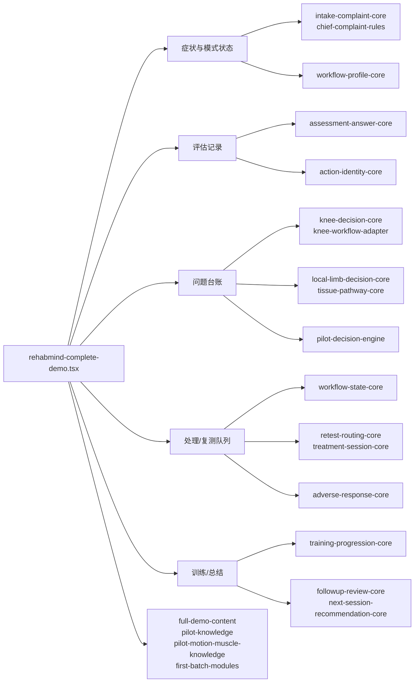

# RehabMind · DeepSeek 接手文档

> 文档用途：给后续维护模型或开发者提供一个单一、可执行的接手入口。
>
> 本文不是第五份临床规则文档。它负责说明“去哪里看、代码怎样组织、状态怎样流转、哪些内容已经确定、哪些内容还要修”。临床和产品规则发生冲突时，仍以四份正式文档为准。
>
> 当前版本：2026-08-16  
> 当前仓库：`D:\Study\codex\project\rehab-thinking-demo`  
> 当前入口：`http://localhost:3000/`

---

## 0. 接手前先读什么

按下面顺序阅读，不要一上来直接改 `rehabmind-complete-demo.tsx`：

1. 本文，了解仓库地图、状态流和已知边界。
2. [产品规范](./rehabmind-complete-product-design.md)，了解页面、模式、数据记录和产品范围。
3. [决策引擎规范](./rehab-decision-framework.md)，了解信息如何变成评估、问题、处理、复测和训练。
4. [膝踝首发知识库](./knee-ankle-pilot-knowledge.md)，了解膝、踝、大腿、小腿的具体候选和优先级。
5. [首发场景验收](./pilot-scenario-coverage.md)，了解必须走通的场景和发布门槛。
6. [真实浏览器走读纪律](./real-browser-flow-audit.md)，了解为什么纯代码测试不够，以及真实页面如何记录。

历史讨论、旧方案和迁移记录只用于追溯，不参与当前规则：

- `docs/archive/`
- `docs/clinical-record-joint-map.md`
- `docs/remaining-joint-record-map.md`
- `docs/full-joint-demo-test-cases.md`
- 其他未列入 `docs/README.md` 的方案文档

如果历史文件与四份正式文档冲突，修改正式文档或提出审核问题，不要把历史规则重新接回代码。

---

## 1. 一句话理解产品

RehabMind 是一个“把用户症状描述转成低风险评估和可复测处理”的桌面端康复思路 Demo：

```text
症状原话/人体图定位
        ↓
安全与关键确认
        ↓
按主诉和能力生成评估队列
        ↓
把结果整理为问题台账（finding/problem）
        ↓
按相关性去重后生成处理单元
        ↓
一批处理 → 一次相关复测 → 决定继续肌肉、关节、训练或跟踪
        ↓
训练与居家自主放松
        ↓
本次阶段成果、下次时间和后续康复
```

产品不做诊断，也不能把“某个病例里有效”直接输出成固定病因或固定处方。每一个现场处理必须有：

- 已确认的主诉或检查证据；
- 明确的处理对象和目标动作；
- 可执行的用户操作；
- 对应的复测动作；
- 明确的后续出口。

---

## 2. 当前范围和明确关闭的能力

### 2.1 当前正式入口

- 大腿局部；
- 膝关节；
- 小腿局部；
- 脚踝与足部。

人体图可以细分到正面、背面、内侧、外侧和具体区域，但目前产品仍只围绕一个主要大部位建立一次完整评估与处理流程。同一大部位内可以选择多个具体症状点。

### 2.2 当前关闭

- 多关节联合处理；
- 骨盆、臀部、腹股沟、髋关节作为独立主诉入口；
- 上肢和脊柱作为当前首发模块；
- 手机端同步适配（除非用户明确重新要求）；
- 语言 AI；
- 视觉 AI；
- 理疗功能；
- 正式病例管理、服务端账户和数据库；
- 动作示意视频/大规模动作图片库；
- 案例学习层（初版先不作为核心入口）。

训练中可以出现髋膝踝协同、臀腿力量、骨盆稳定等动作，但这不等于开放新的髋/骨盆主诉流程。

---

## 3. 文档职责和优先级

正式文档只有四份，各自只承担一个职责：

| 文档 | 负责什么 | 不负责什么 |
| --- | --- | --- |
| `rehabmind-complete-product-design.md` | 产品边界、两种模式、六阶段页面、数据记录和后续康复 | 不重新定义临床候选排序 |
| `rehab-decision-framework.md` | 解析、分流、评估队列、finding、处理、复测、训练和停止条件 | 不描述每个页面的 CSS 排版 |
| `knee-ankle-pilot-knowledge.md` | 膝、踝、大腿、小腿的具体检查、肌肉候选、处理优先级和来源 | 不决定页面按钮和状态机 |
| `pilot-scenario-coverage.md` | 首发场景、组合/极端场景、自动化和真实浏览器验收 | 不新增临床规则 |

优先级：

```text
安全规则
  > 决策引擎规则
  > 产品流程与权限
  > 首发知识候选
  > 测试用例中的具体输入
```

新增结论必须改入原章节，不要在四份正式文档末尾继续堆“补充规则”。本交接文档只记录结构、现状和未完成事项。

---

## 4. 运行时架构

### 4.1 页面入口

```text
app/page.tsx
  └─ <RehabMindCompleteDemo />
       ├─ 症状信息与关键确认
       ├─ 评估队列和记录
       ├─ finding/problem 台账
       ├─ 处理队列、阶段复测
       ├─ 训练与居家
       ├─ 后续康复
       └─ 总结与保存
```

`app/rehabmind-complete-demo.tsx` 目前仍是最大组件，约 69 万字符。它既负责页面编排，也保留部分尚未完全抽离的决策衔接。后续修改必须优先把纯规则放入独立核心，再由页面调用，避免继续在 JSX 条件中复制规则。

### 4.2 按职责分层



### 4.3 代码目录地图

#### 页面和内容

| 文件 | 作用 | 修改时注意 |
| --- | --- | --- |
| `app/page.tsx` | 唯一页面入口 | 不在此增加业务规则 |
| `app/rehabmind-complete-demo.tsx` | 六阶段页面、状态、渲染和决策衔接 | 修改前先读相关纯核心和测试；避免大范围重写 |
| `app/complete-demo.css` | 桌面端视觉样式 | 不用 CSS 修复状态机问题 |
| `app/full-demo-content.ts` | 通用区域、检查、候选、训练内容 | 内容修改需同步验收用例 |
| `app/first-batch-modules.ts` | 首批模块和训练单元 | 仅放已审核的首发内容 |
| `app/rehab-library.ts` | 较完整的旧/通用内容 | 不是首发规则的唯一来源 |
| `app/lower-limb-location-picker.tsx` | 下肢人体图和局部点击区 | 图层、热区和语义区域必须一一对应 |

#### 首发知识和决策

| 文件 | 作用 |
| --- | --- |
| `pilot-knowledge.ts` | 首发区域、病例关系、处理候选和证据等级 |
| `pilot-motion-muscle-knowledge.ts` | 实际动作身份、主肌/拮抗肌/稳定肌及复测关系 |
| `pilot-decision-engine.ts` | 首发信息匹配、评估排序和候选生成 |
| `knee-decision-core.ts` | 膝伸屈、肿胀、股直肌、鹅足、外侧链、腓骨和关节入口 |
| `knee-workflow-adapter.ts` | 膝核心规则与页面旧候选 ID 的映射 |
| `local-limb-decision-core.ts` | 大腿局部、小腿局部独立路径 |
| `local-limb-regions.ts` | 大腿/小腿局部区域和默认内容 |
| `tissue-pathway-core.ts` | 急性拉伤、撞伤、骨应力风险、肌腱负荷等组织路径 |
| `direction-rules.ts` | 动作方向与肌群关系 |
| `chief-complaint-rules.ts` | 主诉动作、症状性质和文字解析辅助规则 |

#### 状态和流程核心

| 文件 | 作用 |
| --- | --- |
| `workflow-profile-core.ts` | 产品模式、操作对象、能力声明与权限 |
| `workflow-state-core.ts` | 动态处理队列重排和稳定的下一目标 |
| `assessment-answer-core.ts` | 活动、力量、无法完成、疼痛等答案归类 |
| `assessment-gap-core.ts` | 找出缺失检查并定位到准确补充项目 |
| `muscle-tension-assessment-core.ts` | 统一肌肉紧张检查 |
| `action-identity-core.ts` | 合并同一个实际动作的不同叫法，避免重复检查/复测 |
| `problem-ledger-core.ts` | 问题台账、处理出口和未路由问题 |
| `treatment-coverage-core.ts` | 处理覆盖、有效、部分有效、无效与方向覆盖 |
| `treatment-response-core.ts` | 处理反馈角色和组合贡献 |
| `treatment-session-core.ts` | 阶段结束、主诉终末复测和训练前复测条件 |
| `retest-routing-core.ts` | 复测结果进入控制训练、关节处理或完成 |
| `followup-review-core.ts` | 第二次及后续康复的趋势、历史和跨次合并 |
| `training-progression-core.ts` | 训练阶段、退阶和下一次进阶 |
| `next-session-recommendation-core.ts` | 下次复查时间窗口 |
| `adverse-response-core.ts` | 处理或训练加重后的停止、聚焦复查和重新生成计划 |

`ankle-guided-workflow.tsx`、`follow-up-workspace.tsx`、`rehab-system.tsx` 等文件属于辅助/旧编排或实验工作区。除非确认当前入口引用它们，否则不要把它们当作主流程的唯一事实来源。

---

## 5. 核心状态模型

页面目前仍将许多状态放在一个组件中，但概念上必须按下面的边界理解：

```text
IntakeState
  ├─ 原始描述（raw）
  ├─ 本地解析候选（parsed）
  ├─ 用户确认（confirmed）
  ├─ 位置/侧别/具体点
  ├─ 当前症状、性质、诱发场景、主诉动作
  └─ 当前会话评分与目标

Safety
  ├─ 红旗信号
  ├─ 骨性风险/影像/医生限制
  └─ 可继续、轻柔检查、医学评估

AssessmentRecord[]
  ├─ action identity
  ├─ 主动范围
  ├─ （专业且有能力）被动范围/末端感觉
  ├─ 力量/主动保持/控制
  ├─ 动作不适和分数
  ├─ 无法完成的原因
  └─ 肌肉紧张位置

Finding[] / ProblemLedger
  ├─ 活动受限
  ├─ 肌肉紧张
  ├─ 力量/控制不足
  ├─ 动作诱发症状
  ├─ 肿胀/跟踪项
  └─ 专项检查线索

TreatmentTrial[]
  ├─ treatmentKey / candidateId
  ├─ 实际处理对象
  ├─ 受影响动作
  ├─ 处理反馈
  ├─ 复测记录
  └─ responseRole（关键、部分贡献、无效、未完成）

Training / SessionHistory
  ├─ 训练动作与阶段
  ├─ 第一组反馈和退阶/进阶
  ├─ 训练后加重事件
  ├─ 本次阶段成果
  └─ 下次复查时间与重点
```

### 5.1 必须保持的状态不变量

1. 原始原话、用户确认、系统推断分开保存；推断不能覆盖确认。
2. `assessmentResults` 只代表本次当前记录；第二次康复不能拿第一次评估值覆盖本次结果。
3. 上次结束分数与本次尚未重新选择的分数分开保存；未重新选择前不比较“变差”。
4. 同一个实际动作只有一个复测身份，例如“大腿前侧拉长”和“膝屈曲”。
5. 因疼痛无法完成是有效 finding，不是漏填；只有“不知道怎么做”才进入补充检查。
6. 处理队列为空不等于没有问题；每个问题必须有现场处理、训练、观察、补充评估或医学评估的去向。
7. 达到健侧/比较目标才算该方向完成；“有改善”是部分有效，不得直接清除。
8. 同一标准肌肉区域同一会话只处理一次；一次处理可覆盖多个相关方向，统一复测。
9. 处理后若仍有被动活动受限，在权限和证据允许时才进入关节处理。
10. 任何返回修改都必须使下游旧计划失效并重新生成，不能继续执行旧队列。
11. 任何加重都必须有明确出口：退阶、聚焦复查、重新评估或停止/转诊。
12. 页面只展示用户当前要做的事；内部决策理由放在代码和可选的简短学习解释中。

---

## 6. 六阶段流程

### 阶段 1：症状信息

普通用户是逐题向导，一次只显示一个要判断的内容；专业模式是结构化工作台，不复用普通逐题界面。两者写入同一套 IntakeState。

必须区分三类动作：

- 受伤经过中的动作；
- 当前真正会诱发症状的动作；
- 用户希望恢复的功能动作。

没有固定动作或用户说不清时，不生成伪主诉动作、虚假分数和伪复测任务。

位置以人体图点击确认结果为准。文本解析只打开建议区域，不自动当作确认。当前主要位置只有一个大部位；同区可补多个具体点，换关节或换侧先确认是否要替换主诉。

肿胀、淤青、按压痛和感觉异常一旦选中，位置图应紧接着出现，不要隔很多题才让用户定位。

### 阶段 2：关键确认

检查红旗、骨性风险、影像和医生限制，输出：

1. 可以继续评估；
2. 轻柔检查并补信息；
3. 先做医学评估。

这一步不应把普通肿胀自动等同于骨折、错位或循环异常。

### 阶段 3：评估检查

队列来自主诉位置、动作、症状性质、机制、目标和用户能力，不执行“这个关节所有检查全部来一遍”。

首发普通用户一般控制在 4～6 项核心检查。专业模式区分必查、建议、可选，可以批量记录和跳过，但每个检查必须有触发证据、检查目的、下游去向和复测动作。

关键首发规则：

- 急性或一般踝足不适固定优先背屈、外翻；主诉明确跖屈或内翻时补相应方向；急性崴脚场景四方向都要覆盖，默认背屈/外翻优先；
- 膝关节基础活动组不可被其他项目挤掉：伸直优先、屈曲随后；
- 活动范围和动作不适在同一个实际动作里完成，后台范围、症状、力量仍分字段；
- 普通用户只做主动活动和自我感受；专业给别人且声明能力后才开放被动、人工抗阻、末端感觉和关节处理；
- 对膝下痛/下楼等主诉，大腿前侧尤其股直肌不能因通用筛选被过滤掉；
- 大腿/小腿局部不能只查“哪里疼”，还要查控制该动作的肌群、拮抗肌和必要的基础功能；但不能因补查而无限扩大队列。

### 阶段 4：针对性处理与复测

处理按批次，不是“一个肌肉→一次主诉复测→下一个肌肉”。基本顺序：

```text
最接近主诉且证据最强的肌肉/软组织
  ↓
统一复测原本异常的主诉、相关活动和不适
  ↓
若主动有改善但仍未达比较目标：继续相关控制/训练
  ↓
若专业被动仍受限且肌肉处理后仍受限：关节处理
  ↓
关节处理后复测对应被动和动作
```

处理反馈不能只看分数下降次数：

- 5→2：部分贡献，不能说无效；
- 2→0：关键贡献，后续训练和放松要保留；
- 活动范围改善但主诉暂未改变：保留活动改善结果，继续按主诉问题处理；
- 目标已达到：从当前处理/复测队列移除；
- 无效：不单独因为无效次数停止，要看是否已覆盖该方向和相关组织；
- 加重：停止当前处理，确认变化后走聚焦复查或医学评估。

主诉如果在某一批处理后的复测中刚刚完成，后面不逐项重复；只有最后一次主诉记录后又发生新处理，阶段结束时再统一复测一次。相同实际动作的活动度、力量和主诉结果不能拆成多次重复询问。

髌骨多方向活动应视为一个处理/复测单元：收集异常方向，一张处理卡完成，一张复测卡统一记录，后台仍按方向保留结果。

### 阶段 5：训练与居家

训练由“能力缺口 + 当前恢复阶段 + 恢复目标”生成，先从用户能安全完成的基础体位开始，再进阶：

```text
仰卧/侧卧基础控制
  → 坐位/站立基础
  → 单腿与动态控制
  → 台阶、跑跳或专项负荷
```

膝、踝足后侧链常见顺序：臀桥 → 单腿臀桥 → 站立屈髋 → 坐站/浅蹲 → 台阶和单腿任务。训练不能因为第一次恢复目标较高就直接跳到高阶动作。

训练结束后的自主放松应从以下去重来源生成，最多 2～3 个：

1. 本次肌肉紧张检查确认的区域；
2. 本次实际处理且有部分/明确效果的肌肉；
3. 本次训练动作涉及的主要肌肉。

有局部风险（急性撞伤、明显肿胀、刺痛、麻电、骨应力）或非标准组织路径（撞伤、骨应力、肌腱负荷）时不整体隐藏自主放松，而是在放松卡上追加「选择性避开」提示（避开淤青血肿中心、避开局限骨性压痛点、避开肿胀部位、避开刺痛点、避开麻电区域、放松周围肌腹而不直接按压肌腱），仍允许对周围安全肌腹做轻柔放松；基础提示始终包含「避开骨点、关节缝、肿胀中心和明确痛点」。

### 阶段 6：本次康复总结和后续

总结必须模块化展示：

1. 评估结果：活动度、肌肉、力量/控制、动作症状；
2. 处理记录：处理对象、针对问题、反馈；
3. 阶段成果：主诉、不适、活动范围的前后变化；
4. 居家训练：动作、组数、次数和训练后自主放松；
5. 下次重点与复查窗口。

“问题仍未达到目标”不能作为笼统的终止页。只有确实还有下一项检查/处理时才显示待处理状态；否则显示本阶段成果，并让用户进入训练巩固。

第二次及以后仍保持相同总体流程：重新确认本次主诉和相关活动，读取上次结束状态，保留上次有效且当前仍存在的处理；上次无效不自动重复，但不是跳过评估和肌肉筛查。主诉分数必须本次重新确认后才能比较。

---

## 7. 普通用户和专业模式

### 7.1 普通用户

- 逐题向导，一页一个判断；
- 选完答案不会自动跳题，必须点击“下一步”；
- 可以跳过“说不清”“不会做”“今天不适合做”；
- 只做主动活动、自我感受、自我轻按、低风险肌肉处理和训练；
- 页面标题使用专业动作名称，下面用一句通俗说明；
- 不要求用户判断 PROM、末端感觉、人工抗阻或自行关节松动。

### 7.2 专业模式

专业模式不是“普通用户页面加几个术语”，而是结构化工作台：

- 操作对象：给自己、给别人；案例学习初版关闭；
- 能力声明：主动活动、被动活动、抗阻/等长、末端感觉、基础触诊、专项检查、关节处理；
- 给自己时不因身份自动开放无法可靠自行完成的 PROM、人工抗阻、末端感觉和关节处理；
- 给别人时，仅在声明相应能力且证据满足时开放；
- 评估可批量填写、跳过并记录原因；
- 处理按高相关批次和阶段性复测，不强制一步一步解释；
- 术语可专业，但操作和判断要能快速执行；
- 学习解释默认关闭，打开后只显示一句简短思路，不展示内部评分、候选排序和算法细节。

关节处理的当前门槛：必须有专业可获得的被动活动受限或明确结构性活动问题；终末感只是辅助证据，不是单独硬门槛。肌肉处理后若被动仍未达到健侧/比较目标，才进入关节处理候选。

---

## 8. 决策引擎的真实顺序

### 8.1 输入层

输入来源有三种可信度，不能混用：

| 来源 | 例子 | 能做什么 |
| --- | --- | --- |
| 原始原话 | “走路踩空后外踝肿” | 记录、产生追问候选 |
| 用户确认 | 点击右侧外踝、选择勾脚不适 | 进入正式决策 |
| 系统推断 | “可能涉及外侧链” | 候选排序，不能当作已确认 finding |

未来接入语言 AI 也只能服务于口语提取和候选召回；安全分流、权限、处理和训练仍由规则引擎执行。

### 8.2 解析和去重

`intake-complaint-core.ts` 与 `chief-complaint-rules.ts` 负责原话/结构化信息的辅助解析；`action-identity-core.ts` 负责把同一个实际动作合并。不要用字符串相等判断动作是否重复。

典型合并：

- 勾脚 ↔ 踝背屈；
- 脚尖向下 ↔ 踝跖屈；
- 大腿前侧拉长（站立主动屈膝）↔ 膝屈曲；
- 下楼和下台阶可以是同一标准功能身份；
- 复合动作（下蹲、下楼、单腿站）不能因为膝屈伸正常就自动清除。

### 8.3 finding 和问题台账

页面可以有很多原始检查记录，但下游只消费问题台账。每个问题必须明确：

- 触发信息；
- 问题类型；
- 当前状态；
- 直接关联动作；
- 处理出口；
- 复测身份；
- 是否仍需训练、观察、补查或转诊。

### 8.4 处理和复测

核心是“覆盖”而不是“每项都单独试一次”。`treatment-coverage-core.ts` 和 `treatment-response-core.ts` 用于记录组合处理中的贡献，不能强行把一串线下处理归因给单一肌肉；同时，要保留最相关区域优先级，便于下一次复查。

`workflow-state-core.ts` 的稳定 `nextTargetId` 用于避免动态队列重排后跳错、卡死或误显示空队列。任何处理后更新都必须让相关动作完成状态、队列和复测计划一起重算。

### 8.5 后续康复和加重

`followup-review-core.ts` 处理跨次趋势；`adverse-response-core.ts` 处理治疗中、训练中、当天晚些时候和次日加重。训练加重不能被误判为处理加重；两者都必须回到明确的停止/确认/聚焦复查出口。

---

## 9. 当前已完成和已修复的重点

以下内容已经进入代码或测试，后续修改不能回退：

- 下肢位置图的区域和侧别记录；
- 单主要大部位入口和多关节联合处理关闭；
- 普通/专业模式的基础分流和能力声明；
- 主诉动作与受伤经过分离；
- 自定义动作保留原话，不强行套标准关键词；
- 活动、力量和动作不适的字段分离，同时按实际动作展示；
- 因疼痛无法完成记录为有效问题；
- 急性踝足背屈/外翻优先，明确跖屈/内翻补充；
- 膝伸直、膝屈曲基础活动组保留；
- 大腿、小腿局部独立路径；
- 同一区域处理去重和统一复测；
- 肌肉处理后被动仍受限才开放专业关节处理；
- 肿胀不在每个手法后反复检查；
- 处理和训练加重的聚焦复查闭环；
- 第二次及以后使用上次结束状态，不直接复用首次评估数据；
- 训练基础体位和渐进链；
- 下次复查时间窗口；
- 动态队列稳定目标和返回修改后的计划失效；
- 普通用户阶段提醒页；
- 评估、处理、训练、总结的关键真实浏览器走读契约；
- 处理复测后的“本阶段成果”中间态（主诉/不适/活动范围变化、有效/部分有效处理、仍需跟进问题、进入训练按钮）；
- 居家自主放松数据流（紧张检查 + 有效处理肌肉 + 训练主要肌肉，去重最多 2～3 个，有局部风险或非标准路径时追加「选择性避开」提示而非整体隐藏，放在训练页与总结页居家训练模块）；
- 髌骨 `patella-mobility-unit` 处理/复测合并（一张处理卡列出受限方向、一张复测卡只复测受限方向、按方向保存、恢复方向退出、纯被动复测模板，处理方向与主诉动作存在运动学关联时随本轮复测主诉）；

---

## 10. 当前仍待整改的事项

P0 三项（处理复测后的阶段成果页、居家自主放松数据流、髌骨 `patella-mobility-unit`）已在本轮整改中完成并移入第 9 节。以下为剩余待整改事项：

### P1：专业模式阶段工作台继续拆分

专业模式目前有独立渲染，但仍有部分决策和页面状态耦合在大组件中。后续应优先抽离：

- 评估批次状态；
- 处理批次状态；
- 阶段复测结果；
- evidence link；
- 阶段成果页。

不能复制一套新的“专业决策引擎”；普通和专业必须消费同一份证据和决策输出。

### P1：全动态队列组合回归

重点覆盖：

- 全阳性踝足；
- 膝肿胀 + 髌下痛 + 下楼；
- 大腿/小腿局部活动受限 + 动作不适 + 肌肉紧张；
- 主诉评分下降但未到 0；
- 所有动作“不会做/做不了/无不适”的组合；
- 主诉与评估动作同身份；
- 返回上一步修改后重新进入；
- 处理中途返回；
- 处理或训练加重；
- 第二、三次康复；
- 处理队列为空但台账仍有观察/训练项；
- 没有可复测动作的局部问题。

要求每个场景都走到明确的训练、总结、聚焦复查或停止出口，不接受“页面没有按钮”“突然结束”“卡死”或“跳到空页面”。

---

## 11. 测试和启动方式

在 `rehab-thinking-demo` 目录执行：

```powershell
npm.cmd run typecheck
npm.cmd run lint
npm.cmd test
git diff --check
```

`npm.cmd test` 会先执行 typecheck/build，再运行 `tests/*.test.mjs`。当前测试集包含：

- 决策核心单元测试；
- 膝/踝/大腿/小腿端到端测试；
- 权限和专业模式测试；
- 后续康复与加重矩阵；
- 动态队列与复测去重；
- 渲染源码契约；
- 真实浏览器走读契约。

本地启动：

```powershell
npm.cmd run dev
```

然后打开 `http://localhost:3000/`。如果已有服务，先确认端口和终端输出，不要重复启动多个服务。

真实页面测试必须实际点击，不接受只读源码结论。至少记录：

- 入口模式和操作对象；
- 主诉部位/侧别/具体位置；
- 每一步选择；
- 页面是否出现正确的下一步；
- 处理后复测是否实时更新；
- 是否出现重复动作或错误模板；
- 是否进入训练、总结或明确的重新评估出口。

---

## 12. DeepSeek 修改时的硬性规则

### 修改前

1. 先定位正式规则所属文档；
2. 再找对应纯核心和测试；
3. 最后读页面调用和渲染；
4. 先写一个最小失败测试或场景，再修改实现。

### 修改中

1. 不要把规则继续堆到 `rehabmind-complete-demo.tsx`；
2. 不要用一个字符串同时承载动作、活动度、力量和症状；
3. 不要用首次评估状态覆盖后续会话状态；
4. 不要把“不知道/无法完成/无不适”静默转成正常；
5. 不要为每个肌肉或每个方向强制新增一次复测；
6. 不要让页面展示内部候选排序、无效次数或“系统复用结果”等算法语句；
7. 不要因一项处理有效就清除其他问题；
8. 不要因一项处理无效就无提示地结束；
9. 不要用“职业身份”直接代替实际能力声明；
10. 不要把病例经验改写为固定诊断或固定病因。

### 修改后

至少同步四处：

```text
纯决策核心
  + 页面编排/展示
  + 对应单元测试和组合测试
  + 正式设计文档
```

关键路径还要真实浏览器走读。任何新状态都要明确：初始值、完成条件、返回修改后的失效条件、保存恢复条件、空队列出口和加重出口。

---

## 13. 推荐的下一次工作顺序

1. 先修 P0 居家自主放松数据流，并补单测和真实训练页走读。
2. 再把“处理复测结束”改成阶段成果页，保留现有决策，仅重组结果展示和训练入口。
3. 抽取髌骨 `patella-mobility-unit`，合并处理与复测，补全四方向和部分恢复场景。
4. 跑完整动态队列组合和极端场景，修复任何提前结束、空页面、重复复测、错误模板和返回后旧状态。
5. 将已验证的新规则回写四份正式文档原章节。
6. 最后再考虑其他关节、视觉 AI、语言 AI、手机端或服务端病例管理。

如果某一修改需要扩大产品范围，先停在方案层并说明影响，不要顺手开放多关节、髋/骨盆、手机端或 AI。

---

## 14. 交接验收标准

DeepSeek 可以认为本阶段完成，必须同时满足：

- 能说明四份正式文档各自负责什么；
- 能从入口追到当前页面实际调用的决策核心；
- 能解释普通用户和专业模式为什么不是同一套页面；
- 能解释一次处理为什么可能影响多个动作、但只需要一次统一复测；
- 能解释主诉改善但未达健侧为什么不能直接结束；
- 能解释关节处理为何必须在肌肉处理和复测之后、且受能力/证据限制；
- 能解释后续康复为什么读取上次结束状态而不是首次评估状态；
- 能解释处理/训练加重如何闭环；
- P0 待整改项有失败测试、修复代码、页面走读和文档同步；
- `typecheck`、`lint`、`test`、`git diff --check` 全部通过。

---

## 15. 最后提醒

这个项目过去出现过多次“代码看起来有规则，但真实走一遍流程就提前结束、重复复测、跳错步骤或没有后续出口”的问题。原因不是单一页面文案，而是页面状态、动态队列、动作身份、跨次数据和决策规则曾经存在多个来源。

因此接手后的判断标准不是“页面上出现了这段文字”，而是：

```text
用户输入
  → 当前状态
  → 评估证据
  → 问题台账
  → 处理批次
  → 相关复测
  → 下一出口
```

这条链必须在代码、测试、真实页面和正式文档中保持一致。
